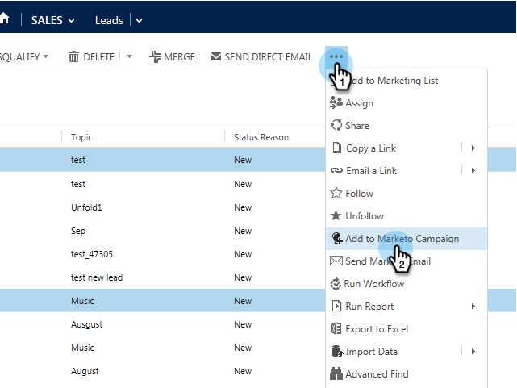

# Lägg till en lead/kontakt i en Marketingkampanj från Microsoft Dynamics {#add-a-lead-contact-to-a-marketo-campaign-from-microsoft-dynamics}

Du kan snabbt och enkelt lägga till leads/kontakter till Marketo smarta kampanjer direkt från Microsoft Dynamics. Så här gör du.

1. Gå till **Sales** i Dynamics.

   

1. Välj en vy.

   

1. Markera en eller flera leads eller kontakter.

   

1. Klicka** ...** och välj **Lägg till i Marketo Campaign**.

   

1. Markera Marketo-kampanjen som du vill lägga till leads eller kontakter i och klicka på **Lägg till**.

   

   >[!NOTE]
   >
   >För att kampanjen ska visas i listrutan använder du [**kampanjutlösaren**](http://docs.marketo.com/pages/viewpage.action?pageId=7514898), med Sales Insight som källa, när du ställer in kampanjen.

Och det där är alla! Nu har ni kraften i Marketos smarta kampanjer i era händer direkt från Dynamics.
