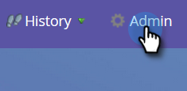

# Inaktivera global [!DNL MS Dynamics]-synkronisering {#disable-global-ms-dynamics-sync}

Följ de här enkla stegen för att inaktivera synkroniseringen av [!DNL MS Dynamics].

1. Klicka på **[!UICONTROL Admin]** i Marketo.

   

1. Klicka på [!UICONTROL Integration] under **[!UICONTROL Microsoft Dynamics]**.

   

1. Klicka på **[!UICONTROL Disable Sync]**.

   

   >[!NOTE]
   >
   >Om du inte ser någon [!UICONTROL Disable Sync]-knapp i din instans kontaktar du [Marketo Support](https://nation.marketo.com/t5/Support/ct-p/Support).
