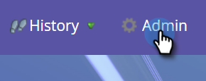

# Avinstallera MSI från din MS Dynamics-instans {#uninstall-msi-from-your-ms-dynamics-instance}

Om du vill avinstallera MSI från MS Dynamics-instansen måste du utföra steg i både Marketo och MS Dynamics.

>[!PREREQUISITES]
>
>[Inaktivera global MS Dynamics-synkronisering](http://docs.marketo.com/x/TAA6Ag)

1. I Marketo klickar du på **Admin**.

   

1. Klicka på **Sales Insight**.

   

1. Klicka på **Redigera fältsynkronisering**.

   

1. Markera kryssrutan **Inaktivera synkronisering** och klicka på **Spara**.

   >[!NOTE]
   >
   >**Påminnelse**
   >
   >
   >Se till att du [inaktiverar Global MS Dynamics Sync](http://docs.marketo.com/x/TAA6Ag) innan du inaktiverar fältsynkroniseringen.

   

## Följande steg utförs i MS Dynamics-instansen: {#the-following-steps-take-place-in-your-ms-dynamics-instance}

1. Klicka på **Avancerade inställningar**.
1. Klicka på **Lösningar**.
1. Välj **Marketo Sales Insight** och klicka på borttagningsikonen.
1. När modala avinstallationslösningar visas klickar du på **OK**.

   Det tar vanligtvis cirka 20 minuter för MS Dynamics-lösningen att avinstallera helt. Men om du har en stor MS Dynamics-instans kan det ta lite längre tid.

   >[!NOTE]
   >
   >**Påminnelse**
   >
   >
   >Kom ihåg att aktivera synkroniseringen för Global MS Dynamics när du har avinstallerat MSI.

