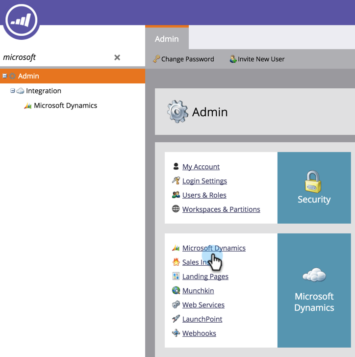
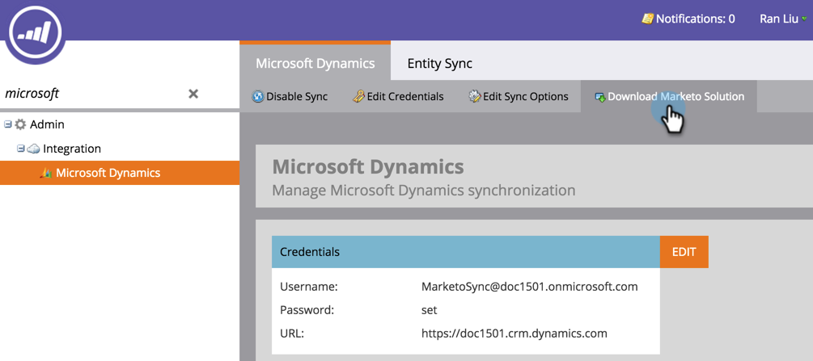

# Uppgradera Marketo Sales Insight Solution för Microsoft Dynamics {#upgrade-the-marketo-sales-insight-solution-for-microsoft-dynamics}

När en ny Microsoft Dynamics-lösning släpps för Sales Insight kan du hämta uppgraderingen från administratörsområdet på ditt konto.

>[!NOTE]
>
>**Administratörsbehörigheter krävs**

1. Gå till **Administratör** område.

   

1. Klicka **Microsoft Dynamics**.

   

1. Välj **Ladda ned Marketo Solution**.

   

1. Välj lämplig lösning för din version av Microsoft Dynamics.

   

   Häftig! En ZIP-fil med lösningen kommer nu att laddas ned till din enhet.

## Utföra uppgraderingen {#performing-the-upgrade}

1. Importera den senaste versionen av lösningen över den befintliga versionen av Dynamics CRM (t.ex.: om Dynamics CRM har version 1.4 och den senaste versionen är 1.5, ska du importera _över_ version 1.4).

2. Följande popup-fönster visas. Välj **Steg för uppgradering** och **Underhåll anpassningar** och sedan klicka **Importera**.

