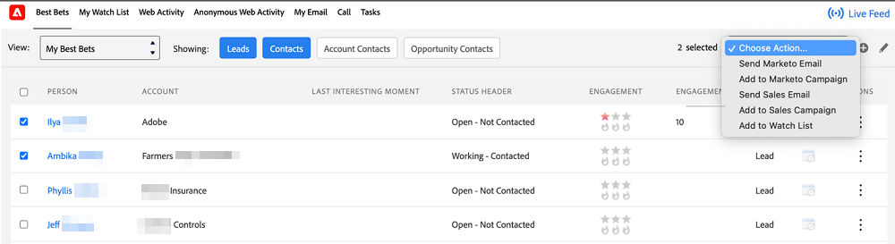

# Lägg till Marketo-flik i Salesforce {#add-marketo-tab-to-salesforce}

1. I Salesforce klickar du på **+** och klicka **Anpassa mina flikar**.

   

1. Välj Marketo i den vänstra listan. Klicka sedan på **Lägg till** för att lägga till den i **Markerade flikar**.

   >[!TIP]
   >
   >Använd **Upp** och **Ned** om du vill ändra tabbordningen.

   

   Här är Marketo-fliken!

   
