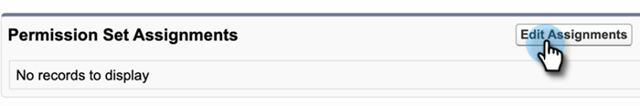

# Lägg till behörighetsuppsättning för [!DNL Sales Insight] {#add-sales-insight-permission-set}

Följ de här stegen för att lägga till åtkomst till [!DNL Sales Insight]-funktioner i [!DNL Salesforce]. Gäller för [!DNL Salesforce] Classic och Lightning

>[!PREREQUISITES]
>
>[Uppdatera ditt [!DNL Sales Insight] [!DNL Salesforce] paket](/help/marketo/product-docs/marketo-sales-insight/msi-for-salesforce/upgrading/upgrading-your-msi-package.md){target="_blank"} till version 1.8000 eller senare om du vill använda den här funktionen.

>[!IMPORTANT]
>
>Om du tidigare har gett [!DNL Sales Insight] åtkomst till alla profiler och/eller implementerat [!DNL Sales Insight] för alla dina användare, måste du [ta bort profilnivååtkomst](/help/marketo/product-docs/marketo-sales-insight/msi-for-salesforce/configuration/remove-sales-insight-access.md){target="_blank"} för att kunna använda den här behörighetsgruppen.

## Översikt {#overview}

Behörigheten &quot;Marketo App&quot; är en del av paketet [!DNL Sales Insight] [!DNL Salesforce]. Den ger åtkomst till nedanstående objekt, API-klasser och visualforce-sidor. Dessa krävs för att komma åt alla [!DNL Sales Insight]-funktioner.

**Objektinställningar**

<table>
 <tbody>
 <tr>
   <td>BestBetsCache</td>
   <td>Läs, skapa, redigera, ta bort, visa alla, ändra alla</td>
  </tr>
  <tr>
   <td>Visningsdetaljer för bästa val</td>
   <td>Läs, skapa, redigera, ta bort, visa alla, ändra alla</td>
  </tr>
  <tr>
   <td>Vyer för bästa val</td>
   <td>Läs, skapa, redigera, ta bort, visa alla, ändra alla</td>
  </tr>
  <tr>
   <td>EmailActivityCache</td>
   <td>Läs, skapa, redigera, ta bort, visa alla, ändra alla</td>
  </tr>
  <tr>
   <td>GetMethodArgus</td>
   <td>Läs, skapa, redigera, ta bort, visa alla, ändra alla</td>
  </tr>
  <tr>
   <td>GroupWebActivityCache</td>
   <td>Läs, skapa, redigera, ta bort, visa alla, ändra alla</td>
  </tr>
  <tr>
   <td>IntressantMomentsCache</td>
   <td>Läs, skapa, redigera, ta bort, visa alla, ändra alla</td>
  </tr>
  <tr>
   <td>Marketo [!DNL Sales Insight]-konfiguration</td>
   <td>Läs, skapa, redigera, ta bort, visa alla, ändra alla</td>
  </tr>
  <tr>
   <td>ScoringCache</td>
   <td>Läs, skapa, redigera, ta bort, visa alla, ändra alla</td>
  </tr>
  <tr>
   <td>Värden</td>
   <td>Läs, skapa, redigera, ta bort, visa alla, ändra alla</td>
  </tr>
  <tr>
   <td>WebActivityCache</td>
   <td>Läs, skapa, redigera, ta bort, visa alla, ändra alla</td>
  </tr>
 </tbody>
</table>

* Apex-klassåtkomst: 159 Apex-klasser som börjar med &quot;mkto_si&quot;
* Visualforce-sidåtkomst: 64 Visualforce-sidor som börjar med &quot;mkto_si&quot;
* Definitioner av anpassade inställningar: mkto_si.Marketo Settings &amp; mkto_si.User Preferences

## Lägga till Marketo App-behörighetsuppsättning till användare {#adding-marketo-app-permission-set-to-users}

1. Logga in på ditt [!DNL Salesforce]-konto.

1. Klicka på **[!UICONTROL Setup]**.

   

1. Under Administratör klickar du för att ta bort **[!UICONTROL Manage Users]** och sedan **[!UICONTROL Users]**.

   

1. Under Alla användare väljer du den användare som du vill ge åtkomst till och klickar sedan på **[!UICONTROL Permission Set Assignments]**.

   

1. Klicka på **[!UICONTROL Edit Assignments]**.

   

1. Välj **[!UICONTROL Marketo App Access]** bland de tillgängliga behörighetsuppsättningarna och sedan **[!UICONTROL Add]**. Klicka på **[!UICONTROL Save]**.

   

1. När du rullar nedåt på sidan Användarinformation visas Marketo App Access under Tilldelningar av behörighetsuppsättningar.

   

>[!NOTE]
>
>Användare som inte har åtkomst till [!DNL Sales Insight] får följande meddelande:&quot;Du har inte behörighet att komma åt den här fliken.&quot;

Nu räcker det! Du har lagt till [!DNL Sales Insight]-åtkomst. Upprepa samma steg för alla andra profiler som du vill lägga till åtkomst för.
