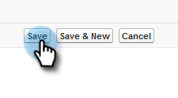

# Konfiguration för befintliga kunder {#configuration-for-existing-customers}

Ställ in följande konfiguration för att börja använda den nya instrumentpanelen för Insights.

>[!PREREQUISITES]
>
>Kontrollera att du har uppgraderat ditt Salesforce-paket till den senaste versionen

## Konfigurera Sales Insight i Marketo {#configure-sales-insight-in-marketo}

1. Öppna en ny flik i webbläsaren och hämta Marketo Sales Insights-autentiseringsuppgifterna från ditt Marketo-konto.

1. Gå till **Administratör** område.

   

1. Klicka **Försäljningsinsikter**.

   

1. Klicka **Visa** för att fylla i Rest API-autentiseringsuppgifter.

   

1. Ett bekräftelsemeddelande visas. Klicka **OK**.

## Konfigurera säljinsikter i Salesforce {#configure-sales-insight-in-salesforce}

1. I Salesforce klickar du på **Inställningar**.

   

1. Sök efter och markera **Inställningar för fjärrplats**.

   

1. Klicka **Ny fjärrplats**.

   

1. Ange fjärrwebbplatsnamnet (det kan vara något som MarketoRestAPI) och URL:en för fjärrplatsen (din API-URL från konfigurationspanelen för Rest API i Marketo).

   

1. Klicka **Spara**.

   

   Du har nu skapat fjärrplatsinställningar för Rest API.

## Öppna Marketo Sales Insight {#access-marketo-sales-insight}

1. Kopiera inloggningsuppgifterna från panelen Rest API på Marketo Sales Insight Admin-sida. Klistra in dem i avsnittet Rest API på Salesforce konfigurationssida Sales Insight.

1. Ange API-hemlig nyckel.

   
