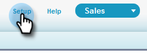

# Konfiguration för befintliga kunder {#configuration-for-existing-customers}

Ställ in följande konfiguration för att börja använda den nya instrumentpanelen för Insights.

>[!PREREQUISITES]
>
>Kontrollera att du har uppgraderat ditt [!DNL Salesforce]-paket till den senaste versionen

## Konfigurera [!DNL Sales Insight] i Marketo {#configure-sales-insight-in-marketo}

1. Öppna en ny flik i webbläsaren för att hämta inloggningsuppgifterna för [!DNL Marketo Sales Insights] från ditt Marketo-konto.

1. Gå till området **[!UICONTROL Admin]**.

   

1. Klicka på **[!UICONTROL Sales Insight]**.

   

1. Klicka på **[!UICONTROL View]** för att fylla i Rest API-autentiseringsuppgifter.

   

1. En bekräftelse visas. Klicka på **[!UICONTROL OK]**.

## Konfigurera [!DNL Sales Insight] i [!DNL Salesforce] {#configure-sales-insight-in-salesforce}

1. Klicka på **[!UICONTROL Setup]** i Salesforce.

   

1. Sök efter och välj **[!UICONTROL Remote Site Settings]**.

   

1. Klicka på **[!UICONTROL New Remote Site]**.

   

1. Ange [!UICONTROL Remote Site Name] (det kan vara något som MarketoRestAPI) och [!UICONTROL Remote Site URL] (din API-URL från Rest API Configuration-panelen i Marketo).

   

1. Klicka på **[!UICONTROL Save]**.

   

   Du har nu skapat fjärrplatsinställningar för Rest API.

## Öppna Marketo Sales Insight {#access-marketo-sales-insight}

1. Kopiera inloggningsuppgifterna från panelen Rest API på administratörssidan för [!DNL Marketo’s Sales Insight]. Klistra in dem i avsnittet Rest API på Salesforce [!DNL Sales Insight]-konfigurationssida.

1. Ange [!UICONTROL API Secret Key].

   
