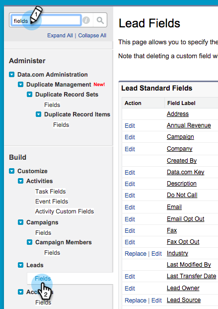
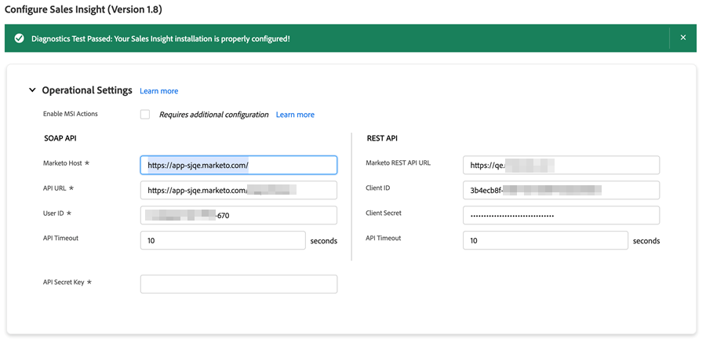

# Konfigurera Marketo Sales Insight i Salesforce Enterprise/Unlimited {#configure-marketo-sales-insight-in-salesforce-enterprise-unlimited}

Konfigurera Marketo Sales Insight i Salesforce Enterprise/Unlimited editions genom att utföra följande steg.

>[!PREREQUISITES]
>
>[Installera Marketo Sales Insight-paket i Salesforce-AppExchange](/help/marketo/product-docs/marketo-sales-insight/msi-for-salesforce/installation/install-marketo-sales-insight-package-in-salesforce-appexchange.md)

>[!NOTE]
>
>**Administratörsbehörighet krävs.**

## Konfigurera säljinsikter i Marketo Engage {#configure-sales-insight-in-marketo}

1. Om du vill ha dina Marketo Sales Insight-uppgifter i Marketo Engage går du till **[!UICONTROL Admin]** område och markera **[!UICONTROL Sales Insight]**.

   

1. Klicka på **[!UICONTROL Edit API Configuration]**.

   

1. Ange en API-hemlig nyckel som du väljer och klicka på **[!UICONTROL Save]**. Använd INTE ett et-tecken (`&`) i API:ts hemliga nyckel.

   

   >[!NOTE]
   >
   >Den hemliga API-nyckeln är som ett lösenord för din organisation och bör vara säker.

1. Om du vill fylla i inloggningsuppgifterna klickar du **[!UICONTROL View]** i _[!UICONTROL Rest API Configuration]_-panelen.

   

1. När du ser en bekräftelsedialogruta klickar du på **[!UICONTROL OK]**.

   

   >[!TIP]
   >
   >Låt det här fönstret vara öppet. Du behöver den här informationen senare för Salesforce-konfigurationen.

## Konfigurera säljinsikter i Salesforce {#configure-sales-insight-in-salesforce}

1. I Salesforce klickar du på **[!UICONTROL Setup]**.

   

1. Sök efter&quot;fjärrwebbplats&quot; och välj **[!UICONTROL Remote Site Settings]**.

   

1. Klicka på **[!UICONTROL New Remote Site]**.

   

1. Ange namnet på fjärrplatsen (det kan likna `MarketoSoapAPI`). Ange URL:en för fjärrplatsen, som är din Marketo-värdadress, på menyn _[!UICONTROL Soap API Configuration]_i Marketo Engage. Klicka på&#x200B;**[!UICONTROL Save]**. Du har nu skapat fjärrplatsinställningar för Soap API.

   

1. Klicka **[!UICONTROL New Remote Site]** igen.

   

1. Ange namnet på fjärrplatsen (det kan likna `MarketoAPI`). Ange URL:en för fjärrplatsen, som är din API-URL från _[!UICONTROL Rest API Configuration]_i Marketo Engage. Klicka på&#x200B;**[!UICONTROL Save]**. Du har nu skapat fjärrplatsinställningar för Rest API.

   >[!NOTE]
   >
   >_Du_ välj **[!UICONTROL Remote Site Name]** (`MarketoAPI` används här). The **[!UICONTROL Remote Site URL]** finns i fältet Marketo Host i dialogrutan Edit API Configuration från steg 3 i avsnittet Configure Sales Insight in Marketo.

## Bevilja åtkomst till Salesforce-standardobjekt för Sales Insight-användarprofiler {#grant-sales-insight-users-profile-access}

På grund av säkerhetsförbättringarna i Salesforce kan AppExchangar inte längre ge behörighet till standardobjekt, och åtkomst måste beviljas till relevanta Salesforce-objekt från Salesforce-användarens profil. Följ de här stegen om du vill ge de behörigheter som krävs.

1. Klicka på **[!UICONTROL Setup]**.

1. Sök efter profiler i Snabbsökning.

1. Klicka **[!UICONTROL Edit]** bredvid profilen som dina Salesforce-användare använder.

1. Under _[!UICONTROL Standard Object Permission]_-sektion, aktivera **[!UICONTROL Read]**åtkomst för följande objekt: [!UICONTROL Lead], [!UICONTROL Contact], [!UICONTROL Account]och [!UICONTROL Opportunity].

1. Klicka på **[!UICONTROL Save]**.

## Anpassa sidlayouter {#customize-page-layouts}

1. Klicka på **[!UICONTROL Setup]**.

   

1. Sök efter&quot;sidlayout&quot; och välj **[!UICONTROL Page Layout]** under **[!UICONTROL Leads]**.

   

1. Klicka **[!UICONTROL Visualforce Pages]** till vänster. Dra **[!UICONTROL Section]** till layouten under _[!UICONTROL Custom Links]_-avsnitt.

   

1. Ange&quot;Marketo Sales Insight&quot; som **[!UICONTROL Section Name]**, markera **[!UICONTROL 1-Column]** och klicka **[!UICONTROL OK]**.

   

1. Dra och släpp **[!UICONTROL Lead]** till det nya avsnittet.

   

   >[!TIP]
   >
   >Namnet på den här rutan ändras baserat på objekttypen. Om du till exempel ändrar sidlayouten för Kontakter visas Kontakt.

1. Dubbelklicka på **[!UICONTROL Lead]** -block som du just har lagt till.

   

1. Redigera höjd till **450** pixlar och klicka **[!UICONTROL OK]**.

   

   >[!NOTE]
   >
   >Kontrollera **[!UICONTROL Show scrollbars]** om du behöver tillgång till genomskärningsaktiviteter.

   >[!TIP]
   >
   >Den rekommenderade höjden för objekten Konton och säljprojekt är 410 pixlar.

1. Klicka **[!UICONTROL Fields]** till vänster. Sök och dra sedan **[!UICONTROL Urgency]** etiketten i **[!UICONTROL Marketo Sales Insight]** layout.

   

1. Upprepa även ovanstående steg för dessa fält.

   * Senaste intressanta stund
   * Senaste intressanta datum
   * Senaste intressanta tillfälle
   * Källa för senaste intressanta stund
   * Typ av senaste intressanta stund
   * Senaste aktivitet efter försäljning
   * Senaste åtagande per försäljning
   * Kontakt-ID för MSI
   * Relativa poäng
   * Relativt poängvärde
   * Akut
   * Värde för nödsituationer
   * Visa i Marketo

1. Klicka **[!UICONTROL Save]** när du är klar.

   

1. Upprepa steg 5-7 för att lägga till Visualforce-sidavsnitt och Sales Insight-fält för **[!UICONTROL Contact]**, **[!UICONTROL Account]** och **[!UICONTROL Opportunity]**.

1. Upprepa steg 8-10 för att lägga till dessa Sales Insight-fält för **[!UICONTROL Contact]**. Var noga med att spara ändringarna.

   * Senaste intressanta stund
   * Senaste intressanta datum
   * [!UICONTROL Last Interesting Moment Desc]
   * [!UICONTROL Last Interesting Moment Source]
   * [!UICONTROL Last Interesting Moment Type]
   * [!UICONTROL Last Marketo Activity by Sales]
   * [!UICONTROL Last Marketo Engagement by Sales]
   * [!UICONTROL MKTO Lead Score]
   * [!UICONTROL Relative Score]
   * [!UICONTROL Relative Score Value]
   * [!UICONTROL Sales Insight] - Öppnar sidan med fullständig kontaktlista
   * [!UICONTROL Urgency]
   * [!UICONTROL Urgency Value]

## Mappa anpassade personfält {#map-custom-person-fields}

Marketo personfält måste mappas till Salesforce-kontaktfält för att konverteringen ska fungera korrekt. Följ de här stegen för att mappa dem.

1. Klicka på **[!UICONTROL Setup]**.

   

1. Sök efter&quot;fält&quot; i sökfältet och klicka på **[!UICONTROL Fields]** under **[!UICONTROL Leads]**.

   

1. Klicka på **[!UICONTROL Map Lead Fields]**.

   

1. Klicka på listrutan till höger för **[!UICONTROL Engagement]**.

   

1. Välj **[!UICONTROL Contact.Engagement]** i listan.

   

1. Upprepa och mappa även dessa fält.

   | Anpassat fält för Marketo-person | Anpassat fält för Salesforce-kontakt |
   |--- |--- |
   | `Engagement` | `Contact.Engagement` |
   | `Relative Score Value` | `Contact.Relative Score Value` |
   | `Urgency Value` | `Contact.Urgency Value` |
   | `Last Interesting Moment Date` | `Contact.Last Interesting Moment Date` |
   | `Last Interesting Moment Desc` | `Contact.Last Interesting Moment Desc` |
   | `Last Interesting Moment Source` | `Contact.Last Interesting Moment Source` |
   | `Last Interesting Moment Type` | `Contact.Last Interesting Moment Type` |

1. Klicka **[!UICONTROL Save]** när du är klar.

## Konfigurationsfliken för Marketo Sales Insight {#marketo-sales-insight-configuration-tab}

1. Klicka på **+** i slutet av flikfältet och klicka på **[!UICONTROL Marketo Sales Insight Config]**.

1. Kopiera inloggningsuppgifterna från Soap API-panelen i [Marketo Sales Insight Admin page](/help/marketo/product-docs/marketo-sales-insight/msi-for-salesforce/configuration/configure-marketo-sales-insight-in-salesforce-professional-edition.md#set-up-marketo-sales-insight){target="_blank"} och klistra in dem i Soap API-avsnittet på Salesforce Sales Insight Configuration-sidan.

1. Kopiera inloggningsuppgifterna från panelen Rest API i [Marketo Sales Insight Admin page](/help/marketo/product-docs/marketo-sales-insight/msi-for-salesforce/configuration/configure-marketo-sales-insight-in-salesforce-professional-edition.md#set-up-marketo-sales-insight){target="_blank"} och klistra in dem i delen Rest API på sidan Konfiguration av Salesforce Sales Insight.

   

Du bör kunna se fälten Marketo Sales Insight för Leads, Contacts, Accounts och Opportunity.

>[!NOTE]
>
>Om diagnostestet misslyckades, [lägga till fler fält i sidlayouten](https://nation.marketo.com:443/t5/knowledgebase/how-to-repair-marketo-sales-insight-setup-configuration-problems/ta-p/248218){target="_blank"} kan åtgärda problemet.

>[!NOTE]
>
>För konton inkluderar Sales Insight alla e-postmeddelanden, men bara de senaste intressanta stunderna, webbaktiviteten och poängändringarna.

>[!MORELIKETHIS]
>
>* [Prioritet, Urklipp, Relativa poäng och Bästa val](/help/marketo/product-docs/marketo-sales-insight/msi-for-salesforce/features/stars-and-flames/priority-urgency-relative-score-and-best-bets.md)
>* [Lägg till fliken Marketo i Salesforce](/help/marketo/product-docs/marketo-sales-insight/msi-for-salesforce/configuration/add-marketo-tab-to-salesforce.md)
>* [Lägg till åtkomst till profiler för Sales Insight](/help/marketo/product-docs/marketo-sales-insight/msi-for-salesforce/configuration/add-sales-insight-access-to-profiles.md){target="_blank"}
