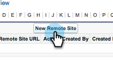

# Konfigurera Marketo Sales Insight i Salesforce Professional Edition {#configure-marketo-sales-insight-in-salesforce-professional-edition}

Här är de steg du måste ta för att konfigurera Marketo Sales Insight i Salesforce Professional Edition. Kom så sätter vi igång.

>[!PREREQUISITES]
>
>* Installera Marketo i Salesforce Professional Edition.
>
>* [Installera Marketo Sales Insight-paket i Salesforce-AppExchange](/help/marketo/product-docs/marketo-sales-insight/msi-for-salesforce/installation/install-marketo-sales-insight-package-in-salesforce-appexchange.md){target="_blank"}

>[!NOTE]
>
>**Administratörsbehörigheter krävs**

## Konfigurera Sales Insight i Marketo {#configure-sales-insight-in-marketo}

1. Öppna ett nytt webbläsarfönster för att hämta inloggningsuppgifterna för Marketo Sales Insight från ditt Marketo-konto.
1. Gå till området Admin och välj **Försäljningsinsikter**.

   

1. Klicka **Redigera API-konfiguration**.

   

1. Ange en API-hemlig nyckel som du väljer och klicka på **Spara**. Använd INTE ett et-tecken (&amp;) i API-hemlighetsnyckeln.

   

   >[!NOTE]
   >
   >Din API-hemliga nyckel är som ett lösenord för din organisation och bör vara säker.

1. Klicka **Visa** på panelen Rest API Configuration för att fylla i autentiseringsuppgifterna.

   

1. Ett bekräftelsemeddelande visas. Klicka **OK**.

   

## Konfigurera säljinsikter i Salesforce {#configure-sales-insight-in-salesforce}

1. I Salesforce klickar du på **Inställningar**.

   

1. Sök efter&quot;fjärrwebbplats&quot; och välj **Inställningar för fjärrplats**.

   

1. Klicka **Ny fjärrplats**.

   

1. Ange namnet på fjärrplatsen (det kan vara något som &quot;MarketoSoapAPI&quot;). Ange URL för fjärrplatsen, som är din Marketo-värd-URL från panelen Konfigurera Soap API i Marketo. Klicka **Spara**. Du har nu skapat fjärrplatsinställningar för Soap API.

   

1. Klicka **Ny fjärrplats** igen.

   

1. Ange namnet på fjärrplatsen (det kan vara något som &quot;MarketoRestAPI&quot;). Ange URL för fjärrplats, som är din API-URL från konfigurationspanelen för Rest API i Marketo. Klicka **Spara**. Du har nu skapat fjärrplatsinställningar för Rest API.

## Ställ in Marketo Sales Insight {#set-up-marketo-sales-insight}

1. Logga in på din Marketo-instans och klicka **Administratör**.

   

1. Klicka **Försäljningsinsikter**.

   

1. Klicka **Redigera API-konfiguration**.

   

1. Ange en **API-hemlig nyckel** och klicka **Spara**.

   >[!CAUTION]
   >
   >Använd inte ett et-tecken (&amp;) i API-hemlig nyckel.

   

   >[!TIP]
   >
   >Låt det här fönstret vara öppet. Du behöver den här informationen senare i Salesforce.

1. Gå tillbaka till Salesforce, klicka **Inställningar**.

   

1. Sök efter&quot;fjärrwebbplats&quot; och klicka på **Inställning för fjärrplats** under **Säkerhetskontroller**.

   

1. Klicka **Ny fjärrplats**.

   

1. Retur **Namn på fjärrplats** och **URL för fjärrwebbplats** och sedan klicka **Spara**.

   

   >[!NOTE]
   >
   >Du väljer **Namn på fjärrplats** (MarketoAPI används här). The **URL för fjärrwebbplats** finns i fältet Marketo Host i dialogrutan Redigera API-konfiguration från steg 4.

## Bevilja åtkomst till Salesforce-standardobjekt i användarprofilen för Sales Insight {#grant-sales-insight-users-profile-access}

På grund av säkerhetsförbättringarna i Salesforce kan App Exchange-paket inte längre ge behörighet till standardobjekt, och åtkomst måste beviljas till relevanta Salesforce-objekt från Salesforce-användarens profil. Följ stegen nedan för att bevilja nödvändiga behörigheter.

1. Klicka **Inställningar**.

1. Sök efter profiler i Snabbsökning.

1. Klicka **Redigera** bredvid den profil som dina Salesforce-användare använder.

1. Aktivera läsåtkomst för följande objekt under avsnittet Standardobjektbehörighet: Lead, Kontakt, Konto och Möjlighet.

1. Klicka **Spara**.

## Anpassa sidlayouter {#customize-page-layouts}

1. Klicka **Inställningar**.

   

1. Sök efter&quot;sidlayout&quot; och välj **Sidlayout** under **Leads**.

   

1. Klicka **Visualforce-sidor** till vänster. Dra **Avsnitt** till layouten under Anpassade länkar.

   

1. Ange&quot;Marketo Sales Insight&quot; som **Avsnittsnamn**. Välj **1 kolumn** och klicka **OK**.

   

1. Dra och släpp **Lead** till det nya avsnittet.

   

   >[!TIP]
   >
   >Namnet på den här rutan ändras beroende på objekttypen. Om du till exempel ändrar sidlayouten för Kontakter står Kontakt.

1. Dubbelklicka på **Lead** -block som du just har lagt till.

   

1. Redigera höjd till **450** pixlar och klicka **OK**.

   

   >[!NOTE]
   >
   >Kontrollera **Visa rullningslister** om du behöver tillgång till genomskärningsaktiviteter.

   >[!TIP]
   >
   >Vi rekommenderar en höjd på 410 pixlar för objekten Konton och Affärsmöjligheter.

1. Klicka på **Fält** till vänster. Sök och dra sedan **Engagemang** etiketten i **Marketo Sales Insight** layout.

   

1. Upprepa även ovanstående steg för dessa fält.

<table> 
 <tbody> 
  <tr> 
   <td colspan="1">Engagemang</td> 
  </tr> 
  <tr> 
   <td colspan="1" rowspan="1">
Relativt poängvärde
</td> 
  </tr> 
  <tr> 
   <td colspan="1" rowspan="1">
Värde för nödsituationer
</td> 
  </tr> 
  <tr> 
   <td colspan="1" rowspan="1">
Senaste intressanta datum
</td> 
  </tr> 
  <tr> 
   <td colspan="1" rowspan="1">
Senaste intressanta tillfälle
</td> 
  </tr> 
  <tr> 
   <td colspan="1" rowspan="1">
Källa för senaste intressanta stund
</td> 
  </tr> 
  <tr> 
   <td colspan="1" rowspan="1">
Typ av senaste intressanta stund
</td> 
  </tr> 
 </tbody> 
</table>

1. Klicka **Spara** när du är klar.

   

1. Upprepa den här processen för att lägga till Visualforce-sidavsnitt och Sales Insight-fält för **Kontakt**, **Konto** och **Möjligheter**.
1. Upprepa steg 5-7 för att lägga till Visualforce-sidavsnitt för kontakt, konto och säljprojekt. Upprepa sedan steg 8-10 för att lägga till Sales Insight-fält för **Kontakt**. Glöm inte att spara efter ändringarna.

## Mappa anpassade personfält {#map-custom-person-fields}

Marketo personfält måste mappas till Salesforce-kontaktfält för att konverteringen ska fungera korrekt. Så här gör du.

1. Klicka **Inställningar**.

   

1. Sök efter&quot;fält&quot; i sökfältet och klicka på **Fält** under **Leads**.

   

1. Klicka **Mappa leadfält**.

   

1. Klicka på listrutan till höger för **Engagemang**.

   

1. Välj **Contact.Engagement** i listan.

   

1. Upprepa och mappa även dessa fält.

<table> 
 <tbody> 
  <tr> 
   <th colspan="1" rowspan="1">Anpassat fält för Marketo-person</th> 
   <th colspan="1" rowspan="1">Anpassat fält för Salesforce-kontakt</th> 
  </tr> 
  <tr> 
   <td colspan="1" rowspan="1">
Engagemang
</td> 
   <td colspan="1" rowspan="1">
Contact.Engagement
</td> 
  </tr> 
  <tr> 
   <td colspan="1" rowspan="1">
Relativt poängvärde
</td> 
   <td colspan="1" rowspan="1">
Kontakt.Relativt poängvärde
</td> 
  </tr> 
  <tr> 
   <td colspan="1" rowspan="1">
Värde för nödsituationer
</td> 
   <td colspan="1" rowspan="1">
Contact.Emergency Value
</td> 
  </tr> 
  <tr> 
   <td colspan="1" rowspan="1">
Senaste intressanta datum
</td> 
   <td colspan="1" rowspan="1">
Kontakt.Senaste intressanta datum
</td> 
  </tr> 
  <tr> 
   <td colspan="1" rowspan="1">
Senaste intressanta tillfälle
</td> 
   <td colspan="1" rowspan="1">
Kontakt.Senaste intressanta tillfälle
</td> 
  </tr> 
  <tr> 
   <td colspan="1" rowspan="1">
Källa för senaste intressanta stund
</td> 
   <td colspan="1" rowspan="1">
Kontakt.Senaste intressanta tidskälla
</td> 
  </tr> 
  <tr> 
   <td colspan="1" rowspan="1">
Typ av senaste intressanta stund
</td> 
   <td colspan="1" rowspan="1">
Kontakt.Senaste intressanta stund
</td> 
  </tr> 
 </tbody> 
</table>

1. Klicka **Spara** när du är klar.

   

## Marketo Sales Insight Configuration Tab {#marketo-sales-insight-configuration-tab}

1. Klicka på **+** i slutet av flikfältet och klicka på **Marketo Sales Insight Config**.

1. Kopiera inloggningsuppgifterna från Soap API-panelen i [Marketo Sales Insight Admin page](/help/marketo/product-docs/marketo-sales-insight/msi-for-salesforce/configuration/configure-marketo-sales-insight-in-salesforce-professional-edition.md#set-up-marketo-sales-insight){target="_blank"} och klistra in dem i Soap API-avsnittet på Salesforce Sales Insight Configuration-sidan.

1. Kopiera inloggningsuppgifterna från panelen Rest API i [Marketo Sales Insight Admin page](/help/marketo/product-docs/marketo-sales-insight/msi-for-salesforce/configuration/configure-marketo-sales-insight-in-salesforce-professional-edition.md#set-up-marketo-sales-insight){target="_blank"} och klistra in dem i delen Rest API på sidan Konfiguration av Salesforce Sales Insight.

   

Och det är allt! Du bör kunna se fälten Marketo Sales Insight för Leads, Contacts, Accounts och Opportunity.

>[!NOTE]
>
>Om diagnostiktestet misslyckades kan du behöva [lägga till fler fält i sidlayouten](https://nation.marketo.com/docs/DOC-1115){target="_blank"}.

>[!NOTE]
>
>För konton kommer Sales Insight att inkludera alla e-postmeddelanden, men bara de senaste intressanta stunderna, webbaktiviteten och poängändringarna.

>[!MORELIKETHIS]
>
>* [Prioritet, Urklipp, Relativa poäng och Bästa val](/help/marketo/product-docs/marketo-sales-insight/msi-for-salesforce/features/stars-and-flames/priority-urgency-relative-score-and-best-bets.md){target="_blank"}
>* [Lägg till fliken Marketo i Salesforce](/help/marketo/product-docs/marketo-sales-insight/msi-for-salesforce/configuration/add-marketo-tab-to-salesforce.md){target="_blank"}
>* [Lägg till åtkomst till profiler för Sales Insight](/help/marketo/product-docs/marketo-sales-insight/msi-for-salesforce/configuration/add-sales-insight-access-to-profiles.md){target="_blank"}
