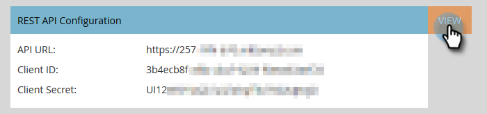

# Konfigurera Marketo Sales Insight i Salesforce Professional Edition {#configure-marketo-sales-insight-in-salesforce-professional-edition}

Här är de steg du måste ta för att konfigurera Marketo Sales Insight i Salesforce Professional Edition. Kom så sätter vi igång.

>[!NOTE]
>
>**Förutsättningar**
>
>[Installera Marketo i din Salesforce Professional Edition](http://docs.marketo.com/display/docs/professional+edition)
>
>[Installera Marketo Sales Insight-paket i Salesforce AppExchange](../../../../product-docs/marketo-sales-insight/msi-for-salesforce/installation/install-marketo-sales-insight-package-in-salesforce-appexchange.md)

>[!NOTE]
>
>**Administratörsbehörigheter krävs**

## Konfigurera Sales Insight in Marketo {#configure-sales-insight-in-marketo}

1. Öppna ett nytt webbläsarfönster för att hämta Marketo Sales Insight-inloggningsuppgifterna från ditt Marketo-konto.
1. Gå till området Admin och välj **Sales Insight**.

   

1. Klicka på **Redigera API-konfiguration**.

   

1. Ange en API-hemlig nyckel som du väljer och klicka på **Spara**. Använd INTE ett et-tecken (&amp;) i API-hemlighetstangenten.

   

   >[!NOTE]
   >
   >Din API-hemliga nyckel är som ett lösenord för din organisation och bör vara säker.

1. Klicka på **Visa** på konfigurationspanelen för det virtuella datorprogrammet för att fylla i inloggningsuppgifterna.

   

1. Ett bekräftelsemeddelande visas. Klicka på **OK**.

   

## Konfigurera säljinsikter i Salesforce {#configure-sales-insight-in-salesforce}

1. Klicka på **Konfigurera** i Salesforce.

   

1. Sök efter&quot;fjärrplats&quot; och välj **Fjärrplatsinställningar**.

   

1. Klicka på **Ny fjärrplats**.

   

1. Ange namnet på fjärrplatsen (det kan vara något som &quot;MarketoSoapAPI&quot;). Ange URL för fjärrplats, som är din Marketo-värd-URL från panelen Konfiguration av Soap API i Marketo. Klicka på **Spara**. Du har nu skapat fjärrplatsinställningar för Soap API.

   

1. Klicka på **Ny fjärrplats** igen.

   

1. Ange namnet på fjärrplatsen (det kan vara något som &quot;MarketoRestAPI&quot;). Ange URL för fjärrplats, som är din API-URL från panelen för konfiguration av återställnings-API i Marketo. Klicka på **Spara**. Du har nu skapat fjärrplatsinställningar för Rest API.

## Ställ in Marketo Sales Insight {#set-up-marketo-sales-insight}

1. Logga in på din Marketo-instans och klicka på **Admin**.

   

1. Klicka** Sales Insight**.

   

1. Klicka på **Redigera API-konfiguration**.

   

1. Ange en **API-hemlig nyckel** och klicka på **Spara**.

   >[!CAUTION]
   >
   >Använd inte ett et-tecken (&amp;) i API-hemlig nyckel.

   

   >[!TIP]
   >
   >Låt det här fönstret vara öppet. Du behöver den här informationen senare i Salesforce.

1. Gå tillbaka till Salesforce och klicka på **Konfigurera**.

   

1. Sök efter&quot;fjärrplats&quot; och klicka på **Fjärrplatsinställning** under **Säkerhetskontroller**.

   

1. Klicka på **Ny fjärrplats**.

   

1. Ange **fjärrplatsnamn** och URL för **fjärrplats** och klicka sedan på **Spara**.

   

   >[!NOTE]
   >
   >Du väljer ditt **fjärrwebbplatsnamn** (MarketoAPI används här). URL:en **för** fjärrplatsen finns i fältet Marketo Host i dialogrutan Redigera API-konfiguration från steg 4.

## Anpassa sidlayouter {#customize-page-layouts}

1. Klicka på **Konfigurera**.

   

1. Sök efter&quot;sidlayout&quot; och välj **Sidlayout** under **Leads**.

   

1. Klicka på **Visualforce-sidor **till vänster. Dra **Avsnitt** till layouten under Anpassade länkar.

   

1. Ange Marketo Sales Insight som **avsnittsnamn**. Markera **1 kolumn** och klicka på **OK**.

   

1. Dra och släpp **Lead** i det nya avsnittet.

   

   >[!TIP]
   >
   >Namnet på den här rutan ändras beroende på objekttypen. Om du till exempel ändrar sidlayouten för Kontakter står Kontakt.

1. Dubbelklicka på det **Lead** -block som du just har lagt till.

   

1. Redigera höjden till **450** pixlar och klicka på **OK**.

   

   >[!TIP]
   >
   >Vi rekommenderar en höjd på 410 pixlar för objekten Konton och Affärsmöjligheter.

1. Klicka på **Fält **till vänster. Sök och dra sedan **engagemangsetiketten** till layouten **Marketo Sales Insight** .

   

1. Upprepa även ovanstående steg för dessa fält.

<table> 
 <tbody> 
  <tr> 
   <td colspan="1">Engagemang</td> 
  </tr> 
  <tr> 
   <td colspan="1" rowspan="1">
Relativt poängvärde
</td> 
  </tr> 
  <tr> 
   <td colspan="1" rowspan="1">
Värde för nödsituationer
</td> 
  </tr> 
  <tr> 
   <td colspan="1" rowspan="1">
Senaste intressanta datum
</td> 
  </tr> 
  <tr> 
   <td colspan="1" rowspan="1">
Senaste intressanta tillfälle
</td> 
  </tr> 
  <tr> 
   <td colspan="1" rowspan="1">
Källa för senaste intressanta stund
</td> 
  </tr> 
  <tr> 
   <td colspan="1" rowspan="1">
Typ av senaste intressanta stund
</td> 
  </tr> 
 </tbody> 
</table>

1. Klicka på **Spara** när du är klar.

   

1. Upprepa den här processen för att lägga till Visualforce-sidavsnitt och Sales Insight-fält för **kontakt**, **konto** och **säljprojekt**.
1. Upprepa steg 5-7 för att lägga till Visualforce-sidavsnitt för kontakt, konto och säljprojekt. Upprepa sedan steg 8-10 för att lägga till Sales Insight-fält för **kontakt**. Glöm inte att spara efter ändringarna.

## Mappa anpassade personfält {#map-custom-person-fields}

Marketo-personfält måste mappas till Salesforce-kontaktfält för att konverteringen ska fungera korrekt. Så här gör du.

1. Klicka på **Konfigurera**.

   

1. Sök efter&quot;fält&quot; i sökfältet och klicka på **Fält** under **Leads**.

   

1. Klicka på **Mappa lead-fält**.

   ** 

   **

1. Klicka på listrutan till höger för **engagemang**.

   

1. Välj **Contact.Engagement **i listan.

   

1. Upprepa och mappa även dessa fält.

<table> 
 <tbody> 
  <tr> 
   <th colspan="1" rowspan="1">Marketo Person, anpassat fält</th> 
   <th colspan="1" rowspan="1">Anpassat fält för Salesforce-kontakt</th> 
  </tr> 
  <tr> 
   <td colspan="1" rowspan="1">
Engagemang
</td> 
   <td colspan="1" rowspan="1">
Contact.Engagement
</td> 
  </tr> 
  <tr> 
   <td colspan="1" rowspan="1">
Relativt poängvärde
</td> 
   <td colspan="1" rowspan="1">
Kontakt.Relativt poängvärde
</td> 
  </tr> 
  <tr> 
   <td colspan="1" rowspan="1">
Värde för nödsituationer
</td> 
   <td colspan="1" rowspan="1">
Contact.Emergency Value
</td> 
  </tr> 
  <tr> 
   <td colspan="1" rowspan="1">
Senaste intressanta datum
</td> 
   <td colspan="1" rowspan="1">
Kontakt.Senaste intressanta datum
</td> 
  </tr> 
  <tr> 
   <td colspan="1" rowspan="1">
Senaste intressanta tillfälle
</td> 
   <td colspan="1" rowspan="1">
Kontakt.Senaste intressanta tillfälle
</td> 
  </tr> 
  <tr> 
   <td colspan="1" rowspan="1">
Källa för senaste intressanta stund
</td> 
   <td colspan="1" rowspan="1">
Kontakt.Senaste intressanta tidskälla
</td> 
  </tr> 
  <tr> 
   <td colspan="1" rowspan="1">
Typ av senaste intressanta stund
</td> 
   <td colspan="1" rowspan="1">
Kontakt.Senaste intressanta stund
</td> 
  </tr> 
 </tbody> 
</table>

1. Klicka på **Spara **när du är klar.

   

## Marketo Sales Insight Config {#marketo-sales-insight-config}

1. Klicka på **+ **och välj sedan **Marketo Sales Insight Config**.

   

1. Markera **Aktivera Marketo API**. Fyll sedan i [API-konfigurationsinformationen i Marketo Admin](http://docs.marketo.com/display/DOCS/Configure+Marketo+Sales+Insight+in+Salesforce+Professional+Edition#ConfigureMarketoSalesInsightinSalesforceProfessionalEdition-SetupMarketoSalesInsight). Klicka på **Spara ändringar **när du är klar.

   

   >[!NOTE]
   >
   >Om diagnostiktestet misslyckas kan du behöva [lägga till fler fält i sidlayouten](http://nation.marketo.com/docs/DOC-1115).

Och det är allt! Du bör kunna se fälten Marketo Sales Insight för Leads, Contacts, Accounts och Opportunity.

>[!NOTE]
>
>För konton kommer Sales Insight att inkludera alla e-postmeddelanden, men bara de senaste intressanta stunderna, webbaktiviteten och poängändringarna.

## Access Marketo Sales Insight {#access-marketo-sales-insight}

1. I Salesforce klickar du på **+** i slutet av flikfältet och klickar på **Marketo Sales Insight Config**.
1. Markera kryssrutan **Aktivera Marketo API** .
1. Kopiera inloggningsuppgifterna från Soap API-panelen på Marketos Sales Insight Admin-sida och klistra in dem i Soap API-avsnittet på Salesforce Sales Insight Configuration-sidan.
1. Kopiera inloggningsuppgifterna från panelen Rest API på Marketos Sales Insight Admin-sida och klistra in dem i delen Rest API på sidan Konfiguration av Salesforce Sales Insight.

   

>[!NOTE]
>
>**Relaterade artiklar**
>
>* [Prioritet, Urklipp, Relativa poäng och Bästa val](../../../../product-docs/marketo-sales-insight/msi-for-salesforce/features/stars-and-flames/priority-urgency-relative-score-and-best-bets.md)
>* [Lägg till Marketo Sales Insight-flik och knappar i Salesforce](../../../../product-docs/marketo-sales-insight/msi-for-salesforce/features/bulk-actions/add-marketo-sales-insight-tab-and-buttons-to-salesforce.md)

>

hh