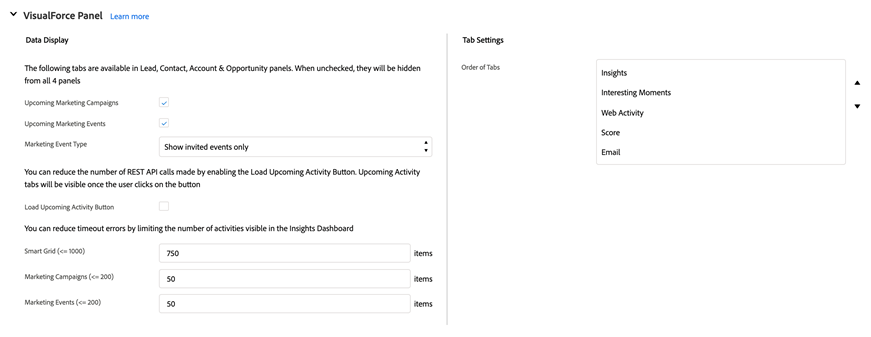
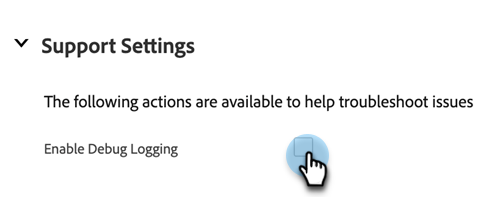

# Marketo Sales Insight Configuration tab in Salesforce {#marketo-sales-insight-configuration-tab-in-salesforce}

## Driftsinställningar {#operational-settings}

Du måste ha konfigurerat detta för att kunna börja använda Sales Insight i SFDC.

* MSI använder både Soap- och Rest-API
* Sidan Sales Insight i ditt Marketo-konto kommer att ha två motsvarande paneler med autentiseringsuppgifterna Soap och Rest API som du kan kopiera och klistra in här
* Programmerings- och återställnings-API har olika tidsgränser som du kan ange utifrån organisationens behov. Den högsta tillåtna tiden är 120 sekunder
* Inaktiverar Instrumentpanelen för insikter: Du kan ta bort Rest API-autentiseringsuppgifter och endast använda Soap API. Om du gör det inaktiveras fliken Insights Dashboard på alla MSI-visualforce-paneler

## MSI-konfiguration {#msi-configuration}

Konfigurationer gäller för alla MSI-användare och är inte specifika för profiler.

**Visualforce-sidinställningar**

* Listrutan Aktivera åtgärd:
   * Möjlighet att dölja Skicka Marketo-e-post i listrutan Lead och Contact MSI Layout
   * Möjlighet att dölja Lägg till i Marketo Campaign-alternativen från listrutan i lead- och Kontakta MSI-layout
* Kommande event: Möjlighet att visa inbjudna händelser, alla händelser för användare eller helt dölja den här fliken
* Kommande kampanjer: Möjlighet att visa alla e-postkampanjer eller dölja den här fliken helt
* Läs in kommande kampanjer och händelser: Möjlighet att minska antalet Rest API-anrop som görs av användare genom att placera händelser och kampanjer på en flik bakom knappen Läs in kommande artiklar på begäran
* Flikinställningar: Alla fem flikarna är tillgängliga som standard. Du kan välja tabbordning på panelen Sales Insight. Samma order gäller för alla layouter (Lead, Contact, Account, Opportunity)

**Marketo Global Tab**

* RSS-flöde aktiverat: När det här alternativet är aktiverat kan MSI-användare visa sin lead-feed i en RSS-feed (utöver lead-feed i Salesforce). RSS-matningen fungerar bara om funktionen &quot;Token Expiration&quot; är inaktiverad. Den här inställningen styrs på sidan Marketo Sales Insight Admin.
* Felsökningsläge för bästa val
* Dölj som standard: Det alternativ du väljer här är det antal dagar som det bästa valet döljs på fliken Bästa val i Marketo när du klickar på Dölj-ikonen
* Kontaktstatusfält: Det alternativ du väljer här är det värde som anges i kolumnen Statusrubrik på fliken Bästa val i Marketo
* Inställningar för Live-feed: Möjlighet att välja att endast visa Live-feed (i panelerna Lead, Kontakt, Konto och säljprojekt samt på den globala Marketo-sidan), endast lead-feed (på Marketo Global Page) eller både Live- och lead-feed
* Flikinställningar: Alla fem flikarna är tillgängliga som standard. Du kan välja tabbordning på Marketo globala sida

**Gränser**

* Aktivitet (Intressant stund, Webbaktivitet, E-post) är som standard inställd på 1 000. E-postkampanjer och händelser är som standard inställda på 200
* Om du får problem med tidsgränsen i din organisation kan du minska den

**Åtgärdsinställningar**

* Skicka Marketo-e-post: Om du aktiverar detta får alla användare av Sales Insight tillgång till e-post från panelerna Lead, Kontakt, Konto, Möjligheter och Bästa val (gruppåtgärder och internt engagemang)
* Lägg till i Marketo Campaign: Om du aktiverar detta får alla användare av Sales Insight tillgång till kampanjer från panelerna Lead, Kontakt, Konto, Möjligheter och Bästa val (gruppåtgärder och internt engagemang)

## Supportinställningar {#support-settings}

Om du markerar den här kryssrutan aktiveras felsökningsloggning i Salesforce-instansen. Det kan hjälpa dig att felsöka problem.

## Återställ Marketo Sales Insight {#reset-marketo-sales-insight}

Om du väljer att göra det raderas alla konfigurationer i SFDC och de kan inte återställas. Du måste konfigurera om allt igen.

>[!IMPORTANT]
>
>Markera inte kryssrutan&quot;Aktivera MSI-åtgärder&quot; om du inte använder funktioner för Säljinsikter-åtgärder.

>[!MORELIKETHIS]
>
>[Lägg till åtkomst till profiler för Sales Insight](/help/marketo/product-docs/marketo-sales-insight/msi-for-salesforce/configuration/add-sales-insight-access-to-profiles.md){target="_blank"}
