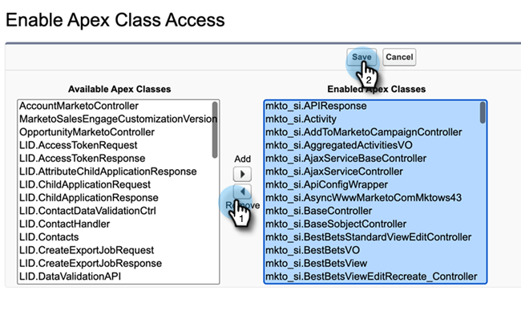

# Ta bort åtkomst till Sales Insight {#remove-sales-insight-access}

Följ de här stegen för att ta bort åtkomsten till Sales Insight-funktionerna i Salesforce. Gäller Salesforce Classic och Lightning.

## Översikt {#overview}

Behörighet till de objekt som nämns nedan, apex-klasser och visualforce-sidor krävs för att få tillgång till alla Sales Insight-funktioner. Om du tar bort dessa tas åtkomsten till Sales Insight bort.

**Objektinställningar**

<table> 
 <tbody> 
 <tr> 
   <td>BestBetsCache</td> 
   <td>Läs, skapa, redigera, ta bort, visa alla, ändra alla</td> 
  </tr> 
  <tr> 
   <td>Visningsdetaljer för bästa val</td> 
   <td>Läs, skapa, redigera, ta bort, visa alla, ändra alla</td> 
  </tr> 
  <tr> 
   <td>Vyer för bästa val</td> 
   <td>Läs, skapa, redigera, ta bort, visa alla, ändra alla</td> 
  </tr> 
  <tr> 
   <td>EmailActivityCache</td> 
   <td>Läs, skapa, redigera, ta bort, visa alla, ändra alla</td> 
  </tr> 
  <tr> 
   <td>GetMethodArgus</td> 
   <td>Läs, skapa, redigera, ta bort, visa alla, ändra alla</td> 
  </tr> 
  <tr> 
   <td>GroupWebActivityCache</td> 
   <td>Läs, skapa, redigera, ta bort, visa alla, ändra alla</td> 
  </tr> 
  <tr> 
   <td>IntressantMomentsCache</td> 
   <td>Läs, skapa, redigera, ta bort, visa alla, ändra alla</td> 
  </tr> 
  <tr> 
   <td>Marketo Sales Insight Config</td> 
   <td>Läs, skapa, redigera, ta bort, visa alla, ändra alla</td> 
  </tr> 
  <tr> 
   <td>ScoringCache</td> 
   <td>Läs, skapa, redigera, ta bort, visa alla, ändra alla</td> 
  </tr> 
  <tr> 
   <td>Värden</td> 
   <td>Läs, skapa, redigera, ta bort, visa alla, ändra alla</td> 
  </tr> 
  <tr> 
   <td>WebActivityCache</td> 
   <td>Läs, skapa, redigera, ta bort, visa alla, ändra alla</td> 
  </tr> 
 </tbody> 
</table>

* Åtkomst till Apex-klass: 159 Apex-klasser som är med &quot;mkto_si&quot;
* Visualforce-sidåtkomst: 64 Visualforce-sidor som är med &quot;mkto_si&quot;
* Definitioner av anpassade inställningar: mkto_si.Marketo Settings &amp; mkto_si.User Preferences

## Tar bort åtkomst till säljinsikter {#removing-access-to-sales-insight}

1. Logga in på ditt Salesforce-konto.

1. Klicka **Inställningar**.

   

1. Under Administratör klickar du på **Hantera användare** sedan **Profiler**.

1. Klicka på profilen som du vill uppdatera och klicka sedan på **Redigera**.

1. Bläddra nedåt till&quot;Anpassade flikinställningar&quot; under Flikinställningar.

1. Välj alternativet &quot;Tabbdolt&quot; i listrutan för Marketo Sales Insight Config och MSI Marketo Sales Outbox.

   

   

1. Bläddra ned till&quot;Anpassade objektbehörigheter&quot;.

1. Ta bort&quot;Läs, Skapa, Redigera, Ta bort&quot;-åtkomst från följande objekt:

   * BestBetsCache
   * Visningsdetaljer för bästa val
   * Vyer för bästa val
   * EmailActivityCache
   * GetMethodArgus
   * GroupWebActivityCache
   * IntressantMomentsCache
   * Marketo Sales Insight Config
   * ScoringCache
   * Värden
   * WebActivityCache

1. Bläddra ned till avsnittet&quot;Aktivera Apex-klassåtkomst&quot;. Klicka **Redigera**.

1. I avsnittet Aktiverade Apex-klasser väljer du alla klasser som börjar med mkto_si. Detta bör innehålla upp till 159 klasser.

1. Klicka **Ta bort** sedan **Spara**.

   

1. Bläddra ned till avsnittet Aktiverad Visualforce-sidåtkomst. Klicka **Redigera**.

1. I avsnittet &quot;Aktiverade Visualforce-sidor&quot; väljer du alla sidor som börjar med &quot;mkto_si&quot;. Detta bör innehålla upp till 64 sidor.

1. Klicka **Ta bort** sedan **Spara**.

   

1. Bläddra ned till avsnittet Aktivera åtkomst till anpassade inställningsdefinitioner. Klicka **Redigera**.

1. Välj&quot;Marketo Sales Insight.mkto_si.Marketo Settings&quot; och&quot;Marketo Sales Insight.mkto_si.User Preferences&quot;.

1. Klicka **Ta bort** sedan **Spara**.

   

Nu räcker det! Du har tagit bort Sales Insight-åtkomst. Upprepa samma steg för alla andra profiler som du vill ta bort åtkomst till.
