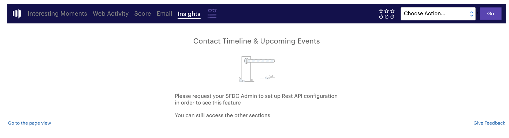

# Sales Insight Page for Marketo Admins {#sales-insight-page-for-marketo-admins}

Marketo-administratörer har vissa privilegier i Sales Insight. Läs vad de är nedan.

## Konfiguration av Soap API {#soap-api-configuration}

De här inloggningsuppgifterna används för att ansluta ditt Salesforce-konto till din Marketo-instans för att använda MSI i Salesforce.

## Återstående API-konfiguration {#rest-api-configuration}

De här inloggningsuppgifterna används för att ansluta ditt Salesforce-konto till din Marketo-instans för att använda MSI Insights Dashboard i Salesforce.

Du kan välja att ta bort Rest API-autentiseringsuppgifter i SFDC och endast använda Soap API:er. Detta inaktiverar Insikt-instrumentpanelen

## Inställningar för personpoäng {#person-score-settings}

| **Stjärnor:** | Stjärnor representerar totalt antal leads jämfört med andra leads. |
|---|---|
| **Lågor:** | Lågor är brådskande - hur mycket en leads poäng har ändrats nyligen. |

Som standard använder Marketo Sales Insight fältet Lead Score för att beräkna stjärnor och lågor. Men om du vill välja ett annat fält, så här:

1. Klicka på **Sales Insight** under **Admin** i Marketo.

   

1. Klicka på **Redigera** under Inställningar för leadpoäng.

   

1. Markera det fält som du vill använda för stjärnor.

   

1. Markera det fält som du vill använda för lågor.

   

1. Klicka på **Spara**. Försäljningsinsikter kan ta lite tid att omberäkna. Du kan kontrollera CRM senare för att se stjärnorna och lågor.

   

   >[!TIP]
   >
   >Om du inte redan har dina anpassade poängfält så här [skapar du dem](http://docs.marketo.com/x/3wMk).

   >[!NOTE]
   >
   >**Relaterade artiklar**
   >
   >
   >[Stjärnor och flamman](http://docs.marketo.com/x/qgU6Ag)

## Inställningar {#settings}

**Avbeställ prenumerationsinställningar: **

Du kan välja bland följande inställningar för att avbryta prenumerationen för Ingen mall, Standardmeddelanden och operativa e-postmeddelanden

* Respektera inställningen för att avbryta prenumerationen
* Respektera inställningarna för att avbryta prenumerationen när fler än en mottagare
* Uppfyll inställningarna för att avbryta prenumerationen när fler än fem mottagare har
* Ignorera inställningar för att avbryta prenumerationen

**Möjlighet att låsa mallar: **

När det här alternativet är aktiverat kan MSI-användare inte redigera mallar när de skickar e-post från Salesforce

**Aktivera RSS-feed:**

När det här alternativet är aktiverat kan MSI-användare visa sin lead-feed i en RSS-feed (utöver lead-feed i Salesforce)**.**
