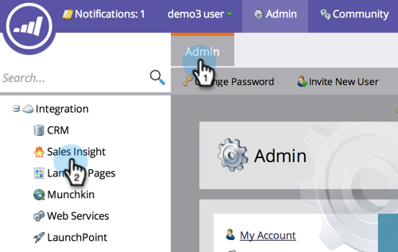

# Sales Insight Page for Marketo Admins {#sales-insight-page-for-marketo-admins}

Marketo-administratörer har vissa privilegier i Sales Insight. Läs vad de är nedan.

## Konfiguration av Soap API {#soap-api-configuration}

Dessa autentiseringsuppgifter används för att ansluta ditt Salesforce-konto till din Marketo-instans för att använda MSI i Salesforce.

## Återstående API-konfiguration {#rest-api-configuration}

De här inloggningsuppgifterna används för att ansluta ditt Salesforce-konto till din Marketo-instans för att kunna använda MSI Insights Dashboard i Salesforce.

## Inställningar för personpoäng {#person-score-settings}

* **Stjärnor**: Stjärnor representerar totalt antal leads jämfört med andra leads.
* **Lågor**: Lågor är brådskande - hur mycket en leads poäng har ändrats nyligen.

Som standard använder Marketo Sales Insight fältet Lead Score för att beräkna stjärnor och lågor. Men om du vill välja ett annat fält, så här:

1. I **Administratör** Marketo klickar du **Försäljningsinsikter**.

   

1. Klicka på under Inställningar för leadpoäng **Redigera**.

   

1. Markera det fält som du vill använda för stjärnor.

   

1. Markera det fält som du vill använda för lågor.

   

1. Klicka **Spara**. Försäljningsinsikter kan ta lite tid att omberäkna. Du kan kontrollera CRM senare för att se stjärnorna och lågor.

   

   >[!TIP]
   >
   >Så här gör du om du inte redan har dina anpassade poängfält [skapa dem](/help/marketo/product-docs/administration/field-management/create-a-custom-field-in-marketo.md).

   >[!MORELIKETHIS]
   >
   >[Stjärnor och flamman](/help/marketo/product-docs/marketo-sales-insight/msi-for-salesforce/features/stars-and-flames/customize-stars-and-flames.md)

## Inställningar {#settings}

**Avbeställ inställningar:**

Du kan välja bland följande inställningar för att avbryta prenumerationen för Ingen mall, Standardmeddelanden och operativa e-postmeddelanden

* Respektera inställningen för att avbryta prenumerationen
* Respektera inställningarna för att avbryta prenumerationen när fler än en mottagare
* Uppfyll inställningarna för att avbryta prenumerationen när fler än fem mottagare har
* Ignorera inställningar för att avbryta prenumerationen

**Möjlighet att låsa mallar:**

När det här alternativet är aktiverat kan MSI-användare inte redigera mallar när de skickar e-post från Salesforce

**Aktivera RSS-feed:**

När det här alternativet är aktiverat kan MSI-användare visa sin lead-feed i en RSS-feed (utöver lead-feed i Salesforce). RSS-feed fungerar bara om funktionen &quot;Token Expiration&quot; är inaktiverad.

**Giltighetstid för token:**

Förfallotid för token styrs i Funktionshanteraren. Om du vill aktivera/inaktivera den kan du kontakta [Marketo Support](https://nation.marketo.com/t5/Support/ct-p/Support). När det här alternativet är aktiverat upphör alla Marketo-tokens att gälla inom 10 minuter. När funktionen är inaktiverad upphör inte Marketo-tokens att gälla.

Token som genererats innan Token Expiration aktiverades har ingen förfallotid att validera mot, så de upphör inte att gälla även om funktionen är aktiverad.

Token som genereras efter att Token Expiration aktiverats har en förfallotid på 10 minuter, så de går fortfarande ut om 10 minuter även efter att funktionen har inaktiverats.

Tokenbeteendet baseras på när det genererades (när funktionen för förfallodatum för token aktiverades/inaktiverades, i stället för på dess nuvarande funktionsstatus).
