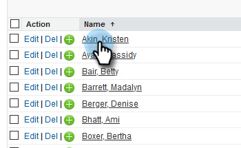

# Lägg till en lead/kontakt i en Marketkampanj från Salesforce {#add-a-lead-contact-to-a-marketo-campaign-from-salesforce}

Du kan enkelt lägga till leads eller kontakter till smarta Marketinkampanjer inifrån Salesforce. Så här använder ni leads.

1. Klicka på fliken **Leads **i Salesforce.

   

1. Markera listan med personer som du vill visa i listrutan och klicka på **Gå**.

   

   >[!NOTE]
   >
   >Urvalslistan i listrutan innehåller Alla öppna leads eller olästa leads, Senast visade leads, Dagens leads och kan innehålla andra kategorier.

1. Välj en lead i listan för att öppna posten.

   

1. Rulla ned till Marketo Sales Insight, klicka på listrutan **Åtgärder**, välj **Lägg till i Marketo Campaign,** och klicka på&#x200B;**Gå.**

   

1. Klicka på listrutan **Kampanjnamn**, välj önskad Marketo-kampanj och klicka på **Lägg till i Marketo Campaign**.

   

   >[!NOTE]
   >
   >För att kampanjen ska visas i listrutan använder du [**Kampanjen är begärd** utlösare](../../../../../../product-docs/core-marketo-concepts/smart-campaigns/using-smart-campaigns/setting-up-a-trigger-smart-campaign-for-sales-using-campaign-is-requested.md), med **Sales Insight** som källa när du konfigurerade kampanjen.

Och det är allt! Personen läggs till i er Marketo-kampanj.