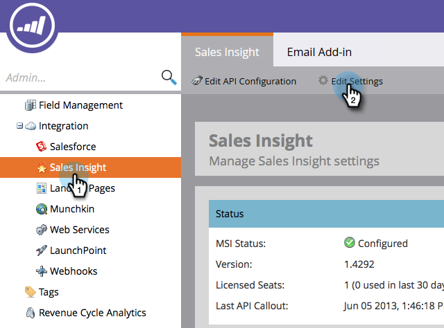

# Konfigurera sidfot för att avbryta prenumerationen i [!DNL Marketo Sales Insight] {#configure-unsubscribe-footers-in-marketo-sales-insight}

Säljmejl placerar automatiskt sidfoten längst ned. Du kan dock justera inställningarna efter dina behov.

>[!NOTE]
>
>**Administratörsbehörigheter krävs**

>[!NOTE]
>
>**Definition**
>
>**Försäljningsmeddelanden** är de som skickas från [!DNL Sales Insight] (de som inte skickas från Marketo Outlook-plugin-programmet).

1. Gå till området **[!UICONTROL Admin]**.

   

1. Klicka på **[!UICONTROL Sales Insight]** och sedan på **[!UICONTROL Edit Settings]**.

   

   Det finns flera alternativ. Först tittar vi på de typer av e-post som du kan ändra inställningarna för.

   

   * **[!UICONTROL No Template]** - Manuellt sammansatt av säljanvändare.
   * **[!UICONTROL Standard Email]** - E-postmeddelanden baserade på en mall.
   * **[!UICONTROL Operational Email]** - E-postmeddelanden som ignorerar Avsluta prenumeration, Markering pausad och Kommunikationsbegränsningar (de skickas oavsett vad).

   Du kan ange olika beteenden för varje typ.

   >[!CAUTION]
   >
   >**[!UICONTROL Respect Unsubscribe Settings]**: leads för avbeställning får INTE e-postmeddelandet även om det publicerade e-postmeddelandet fungerar
   >
   >**[!UICONTROL Ignore Unsubscribe Settings]**: leads för avanmälan får e-postmeddelandet

1. Gör önskade ändringar och klicka sedan på **[!UICONTROL Save]**.

   >[!TIP]
   >
   >De två sista alternativen gör att du dynamiskt kan inkludera/exkludera sidfoten för avanmälan beroende på antalet mottagare (större än 1 eller större än 5).

   

Vis! Lite komplicerat, men ganska flexibelt, eller hur?
