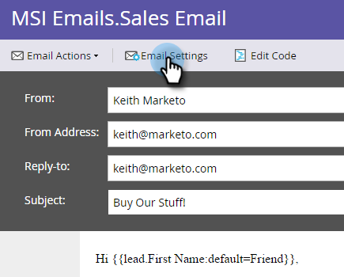

# Publicera ett e-postmeddelande till [!DNL Sales Insight] {#publish-an-email-to-sales-insight}

Aktivera inställningen Publicera till [!DNL Sales Insight] om du vill att ett e-postmeddelande ska vara tillgängligt för ditt säljteam i både [!DNL Sales Insight] och [!DNL Outlook]- och Gmail-tillägget. Du kan också ange ett förfallodatum.

1. Leta reda på din e-postadress, markera den och klicka på **[!UICONTROL Edit Draft]**.

   

1. När redigeraren öppnas klickar du på **[!UICONTROL Email Settings]**.

   

1. Kontrollera **[!UICONTROL Publish to Marketo Sales Insight]**.

   

1. Om du vill ange ett förfallodatum (valfritt) markerar du **[!UICONTROL Set Expiration]** och väljer ett datum.

   

   >[!NOTE]
   >
   >Kl. 21:00 (CST) på förfallodatumet (om du anger ett) försvinner det e-postmeddelande du gjort tillgängligt från :59 och alla dess tillägg. [!DNL Sales Insight] Den kommer naturligtvis fortfarande att vara tillgänglig i Marketo.

1. Klicka på **[!DNL Save]**.

   

Snyggt jobb! Nu vet du hur du kan göra e-postmeddelanden tillgängliga för säljarna så att de kan skicka via CRM-sidan, och begränsa deras tillgängliga tid om det behövs.

>[!NOTE]
>
>[Mina token](/help/marketo/product-docs/core-marketo-concepts/programs/tokens/understanding-my-tokens-in-a-program.md) kommer inte att matchas när du skickar ett e-postmeddelande från [!DNL Sales Insight] på antingen [!DNL Microsoft Dynamics] eller [!DNL Salesforce]. Endast standardtoken fylls i (Lead, Company, etc.). Standardvärden för tokens fungerar dock.

>[!TIP]
>
>Glöm inte att godkänna det här e-postmeddelandet för att ändringarna ska börja gälla. Lär dig hur du [godkänner e-post](/help/marketo/product-docs/email-marketing/general/creating-an-email/approve-an-email.md).
