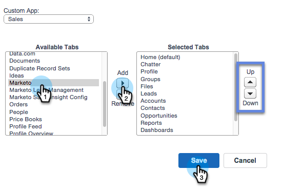
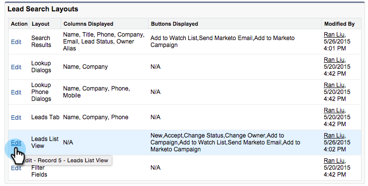

# Lägg till Marketo Sales Insight-flik och knappar i Salesforce {#add-marketo-sales-insight-tab-and-buttons-to-salesforce}

Du kan lägga till anpassade Marketo Sales Insight-flikar och knappar i Salesforce-vyn för enkel åtkomst. Intresserad? Så här gör du.

## Lägga till markeringsfliken  {#adding-the-marketo-tab}

1. Klicka på** + **och klicka på **Anpassa mina flikar**.

   

1. Välj Marketo i den vänstra listan. Klicka sedan på **Lägg** till för att lägga till den på de **markerade flikarna**.

   >[!TIP]
   >
   >Använd **upp** - och **nedpilarna** för att ordna om tabbarna.

   

   Här är din Marketo-flik!

   

## Lägga till markeringsknappar {#adding-marketo-buttons}

Du kan lägga till Marketo-knappar i dina Salesforce-layouter. Här är ett exempel:

1. Klicka på **Konfigurera**. Sök efter&quot;söklayout&quot; och klicka på **söklayouten** under **Leads**.

   

1. Klicka på **Redigera** i **Radlista **rad.

   

1. Lägg till **Lägg till i Marketi Kampanj**, **Skicka Marketi-e-post** och **Lägg till i bevakningslista** till knapparna **Markerade knappar** och **Spara**.

   

   >[!TIP]
   >
   >Tryck på och håll ned skifttangenten för att markera alla tre knapparna samtidigt.

1. Upprepa dessa steg för Kontakter (alla tre knapparna) och Konton (endast en knapp: Lägg till i bevakningslista).

   >[!NOTE]
   >
   >Du kan inte lägga till Marketo-knappar i säljprojekt.

Bra jobbat!
