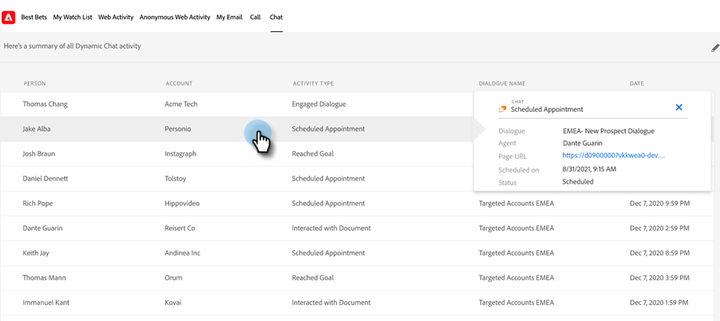

# Dynamic Chat Integration {#dynamic-chat-integration}

Läs mer om Dynamic Chat integrering med Sales Insight.

>[!PREREQUISITES]
>
>* Ditt Sales Insight SFDC-paket måste vara version [2.4.0 eller senare](/help/marketo/product-docs/marketo-sales-insight/msi-for-salesforce/upgrading/upgrading-your-msi-package.md){target="_blank"}
>
>* [Dynamic Chat-integrering](/help/marketo/product-docs/demand-generation/dynamic-chat/dynamic-chat-overview.md){target="_blank"} måste vara konfigurerad
>
>* Kontrollera att fältet API-hemlig nyckel är ifyllt i [driftsinställningarna](/help/marketo/product-docs/marketo-sales-insight/msi-for-salesforce/configuration/marketo-sales-insight-configuration-tab-in-salesforce.md#operational-settings){target="_blank"} i din Sales Insight. Lär dig hur du hämtar det [här](/help/marketo/product-docs/marketo-sales-insight/msi-for-salesforce/configuration/configure-marketo-sales-insight-in-salesforce-enterprise-unlimited.md#configure-sales-insight-in-marketo){target="_blank"} om du inte gör det.

## Fliken Konfiguration för [!DNL Marketo Sales Insight] {#marketo-sales-insight-configuration-tab}

Följ stegen nedan för att aktivera integreringen av [!DNL Dynamic Chat].

1. Logga in på ditt [!DNL Salesforce]-konto, klicka på + i slutet av flikfältet och klicka på **[!DNL Marketo Sales Insight Config]**.

1. Klicka om du vill ta bort [!UICONTROL Visualforce Panel].

   

1. Markera kryssrutan **[!UICONTROL Enable Dynamic Chat Data]**.

   

## Översikt över funktioner {#feature-overview}

Följande [!DNL Dynamic Chat] aktiviteter kan utnyttjas av [!DNL Sales Insight]-användare..

Engaged Dialog: Loggade in Marketo och fylldes i i [!DNL Sales Insight] när en besökare klickar på en chattbot och engagerar sig i dialogrutan.

* Dialogrutenamn
* Sidans URL
* Status (initierad/släppt/slutförd)

Schemalagd avtalad tid: Inloggad i Marketo och fylld i [!DNL Sales Insight] när en besökare har schemalagt en avtalad tid via chattbot.

* Dialogrutenamn
* Agent
* Sidans URL
* Schemalagd den (infoga datum- och tidsstämpel)
* Status (schemalagd, schemalagd, annullerad)

Uppnått mål: Inloggad i Marketo och ifylld i [!DNL Sales Insight] när en besökare når ett mål i något dialogflöde.

* Dialogrutenamn
* Målnamn
* Sidans URL

Interagera med dokument: Inloggad i Marketo och ifylld i [!DNL Sales Insight] när en besökare interagerar med ett dokument som delas via chattbot.

* Dialogrutenamn
* Dokument
* Status

Chattaktiviteter är tillgängliga i Insights Dashboard.

Fliken Chatt finns på panelerna Lead och Kontakt. Den innehåller [!UICONTROL Activity Type], [!UICONTROL Dialogue Name] och [!UICONTROL Date] kolumner.

Du kan lära dig mer om en aktivitetstyp genom att klicka på den.

På samma sätt innehåller panelerna Konto och säljprojekt [!UICONTROL Name], [!UICONTROL Activity Type], [!UICONTROL Dialogue Name] och [!UICONTROL Date] kolumner.

Fliken Chatt finns även på fliken Global Marketo. Den innehåller tre aktivitetstyper ([!UICONTROL Engaged Dialogue], [!UICONTROL Scheduled Appointment], [!UICONTROL Reached Goal]) tillsammans med följande kolumner:

* [!UICONTROL Person]
* [!UICONTROL Account]
* [!UICONTROL Activity type] ([!UICONTROL Engaged Dialogue], [!UICONTROL Scheduled Appointment], [!UICONTROL Reached Goal])
* [!UICONTROL Dialogue Name]
* [!UICONTROL Date]

Återigen kan du lära dig mer om en aktivitetstyp genom att klicka på den.

>[!NOTE]
>
>Om kryssrutan [!UICONTROL Enable Dynamic Chat data] är inaktiverad inaktiveras följande funktioner:
>
>* Rad med chattaktiviteter på Instrumentpanelen för insikter (smart rutnät och listvy varje vecka)
>* Fliken Chatt på panelerna Lead, Kontakt, Konto och Möjligheter
>* Fliken Chatt på fliken Global Marketo
>
>Det går inte att inaktivera endast en av dessa funktioner.

