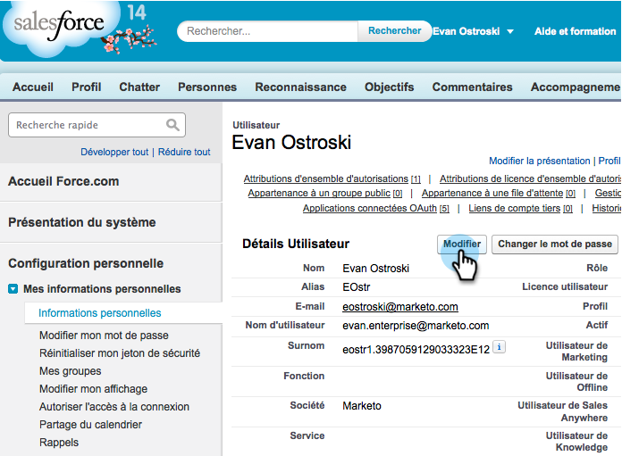

# Förbered Sales Insight for Multi-Lingual Support in Salesforce {#prepare-sales-insight-for-multi-lingual-support-in-salesforce}

>[!NOTE]
>
>**Administratörsbehörigheter krävs**

Marketo Sales Insight lagras på språk. Om du vill att det ska fungera för mer än ett språk måste du ange inloggningsuppgifterna separat för varje språk.

>[!NOTE]
>
>[!DNL Sales Insight] stöder för närvarande:
>
>* Engelska
>* Franska
>* Tyska
>
>Alla andra språk är som standard engelska.

## Lägger till ett nytt språk för [!DNL Marketo Sales Insight] {#adding-a-new-language-for-marketo-sales-insight}

1. Logga in på [!DNL Salesforce]. Klicka på **[!UICONTROL Setup]** i listrutan under ditt namn i det övre högra hörnet.

   

1. Klicka på **[!UICONTROL My Personal Information]** under **[!UICONTROL Personal Information]**.

   

1. Klicka på **[!UICONTROL Edit]**.

   

1. Välj ett språk och klicka på **[!UICONTROL Save]**.

   

1. Gränssnittet [!DNL Salesforce] finns nu på det valda språket. Du kan klicka på ikonen **+** för att visa alla tillgängliga flikar.

   

1. Klicka på **[!UICONTROL Configure Marketo Sales Insight]** (på det valda språket).

   

1. Gå till Marketo. Leta reda på dina [[!DNL Marketo Sales Insight] **[!UICONTROL API configuration]**-uppgifter](/help/marketo/product-docs/marketo-sales-insight/msi-for-salesforce/configuration/configure-marketo-sales-insight-in-salesforce-enterprise-unlimited.md#configure-marketo-sales-insight).

   

1. Ange API-informationen från Marketo och klicka på **[!UICONTROL Save]**.

   

## Ändra tillbaka [!DNL Salesforce] till engelska {#change-salesforce-back-to-english}

När du har anpassat din [!DNL Salesforce]-organisation gör du så här för att returnera din personliga konfiguration till engelska.

>[!NOTE]
>
>Följande skärmbilder är på franska med instruktioner på engelska.  Du ser samma skärmar med text på det språk du valde i föregående steg.

1. Klicka på **[!UICONTROL Setup]** under ditt namn.

1. Klicka på **[!UICONTROL Personal Information]** under **[!UICONTROL My Personal Information]**.

   

1. Klicka på **[!UICONTROL Edit]**.

   

1. Välj **[!UICONTROL English]** i listrutan Språk och klicka på **[!UICONTROL Save]**.

   

   Nu är din [!DNL Salesforce] tillbaka på engelska!
