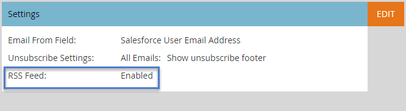

# Aktivera RSS för Sales Insight {#enable-rss-for-sales-insight}

>[!NOTE]
>
>**Administratörsbehörigheter krävs**

Om Marketo-användare vill visa sin lead-feed inte bara i Salesforce, utan även i en RSS-feed, måste Marketo Admin först aktivera den. Det är lätt.

1. I My Marketo klickar du på **Admin** och sedan **Sales Insight**.

   

1. Klicka på **Redigera** på Inställningar. Observera att RSS-flödet visas som **Inaktiverat**.

   

   I dialogrutan Redigera inställningar markerar du kryssrutan **RSS-feed** och klickar på **Spara**.

   

   RSS-flödet visas nu som **Aktiverad**.

   

   Kakbit!

