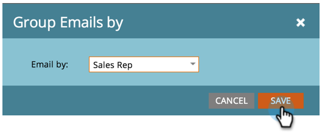

# E-postresultatrapport för Sales Insight {#sales-insight-email-performance-report}

Visa prestanda för e-postmeddelanden som skickas via Salesforce, Microsoft Dynamics eller ett Gmail- eller Outlook-plugin-program.

## Generera en rapport {#generate-a-report}

1. Klicka på **Analytics**.

   

1. Klicka på **Sales Insight Email Performance**.

   

1. Klicka på fliken **Inställningar** och välj önskade värden.

   

1. Klicka på fliken **Rapport** .

   

   Bra! Nu kan du se hur e-postmeddelanden som skickas från ditt säljteam har fungerat.

   >[!NOTE]
   >
   >Levererad status hämtas inte för e-postmeddelanden som skickas via Sales Insight och inkluderas inte i den här rapporten eller aktivitetsloggarna.

>[!TIP]
>
>Klicka på namnet på ett e-postmeddelande för att öppna det i E-postförhandsgranskaren.

## Gruppera efter säljare {#group-by-sales-rep}

Du kan visa den här rapporten grupperad efter säljare genom att ändra dina inställningar.

1. Klicka på **Konfigurera**. Dubbelklicka på **E-post**.

   

1. Välj Gruppera e-postmeddelanden efter **säljare**.

   

1. Klicka på **Spara**.

   

1. Klicka på fliken **Rapport** .

   

   Ganska coolt, va? Nu kan du se hur e-postmeddelanden fungerar grupperat efter säljare.

