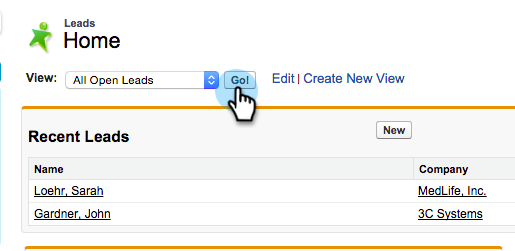

# Skicka ett e-postmeddelande till flera poster i Marketo Sales Insight {#send-an-email-to-multiple-records-in-marketo-sales-insight}

Det är superenkelt att skicka ett Marketo-mejl till flera personer med Marketo Sales Insight. Kom så sätter vi igång.

1. Klicka på **Leads** eller **Kontakter** i Salesforce.

   

1. Klicka på **Gå** om du vill visa alla öppna leads.

   

1. I listvyn markerar du alla leads/kontakter som du vill skicka e-post till och klickar på **Skicka e-post från Marketo (klassisk)**.

   

   >[!NOTE]
   >
   >Om du använder Salesforce Lightning står det **Skicka e-post från Marketo (blixt)** på knappen.

   >[!TIP]
   >
   >Ser du inte knappen? Kontrollera att du har [lagt till Marketo-knappar i listvyn](/help/marketo/product-docs/marketo-sales-insight/msi-for-salesforce/configuration/add-bulk-action-buttons-to-salesforce-classic.md).

1. Skriv e-postmeddelandet nu. Klicka på **Skicka med Marketo** när du är klar.

   

   >[!TIP]
   >
   >Du kan [publicera e-post till Sales Insight](/help/marketo/product-docs/marketo-sales-insight/msi-for-salesforce/features/actions-in-the-msi-panel/send-marketo-email/publish-an-email-to-sales-insight.md) och välja bland dessa e-postmeddelanden.

   >[!NOTE]
   >
   >Du kan skicka upp till 200 e-postmeddelanden från Marketo åt gången.
