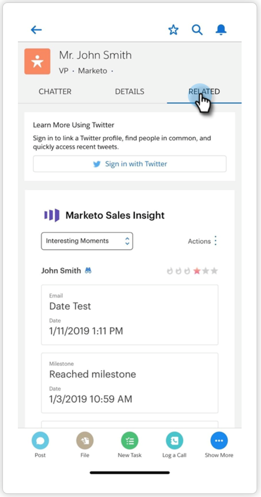

# Använda intressanta stunder {#using-interesting-moments}

Intressanta ögonblick är nyckeln till att kommunicera med säljarna via appen Marketo Sales Insight.

>[!AVAILABILITY]
>
>Dessa finns för Marketo Sales Insight och [Marketo Sales Connect](/help/marketo/product-docs/marketo-sales-connect/marketo/interesting-moments-in-sales-connect.md) endast kunder.

## Vad är ett intressant ögonblick? {#what-is-an-interesting-moment}

Det är upp till dig! Du bestämmer själv vilken information som är relevant för säljteamet. Säljteamet kanske vill veta när en lead:

* Besök prissidan på din webbplats
* Klicka på en länk i ett e-postmeddelande om en ny produkt
* Begär en produktdemo

## Hur skapar jag ett intressant ögonblick?  {#how-do-i-create-an-interesting-moment}

1. Välj en [smart kampanj](/help/marketo/product-docs/core-marketo-concepts/smart-campaigns/understanding-smart-campaigns.md), helst en som ditt säljteam tycker är intressant om det utlöses.

   

1. Dra över **Intressanta ögonblick** flödessteg.

   

1. Välj en **type** (E-post, Milstolpe eller Webb).

   

1. Skriv ett meddelande till ditt säljteam i **Beskrivning** fält som förklarar varför den här åtgärden är viktig.

   

   >[!NOTE]
   >
   >Marketo lägger också till datumet det inträffade och hur det intressanta ögonblicket lades till (dvs lead action > flow step, SOAP API).

## Hur kan det här bli ännu intressantare?  {#how-can-this-get-even-more-interesting}

Tokens! Lägg till dem i beskrivningsfältet för att ge säljteamet mer specifik information, som ämnesraden i det e-postmeddelande som leadet öppnade eller vem det skickades av. Kontrollera vilka variabler som är tillgängliga för användning i [Token för intressanta ögonblick](/help/marketo/product-docs/marketo-sales-insight/msi-for-salesforce/features/tabs-in-the-msi-panel/interesting-moments/trigger-tokens-for-interesting-moments.md) ordlista.

>[!TIP]
>
>Börja med fem intressanta ögonblick och samarbeta sedan med säljarna för att ta reda på vilken information de är intresserade av att se.

## Hur ser ett intressant ögonblick ut i Marketo?  {#what-does-an-interesting-moment-look-like-in-marketo}

Intressanta stunder visas i en [Lead-aktivitetsloggen](/help/marketo/product-docs/core-marketo-concepts/smart-lists-and-static-lists/managing-people-in-smart-lists/using-the-person-detail-page.md).

## Hur ser ett intressant ögonblick ut i Salesforce?  {#what-does-an-interesting-moment-look-like-in-salesforce}

När du har [installerade Marketo Sales Insight App](/help/marketo/product-docs/marketo-sales-insight/msi-for-salesforce/configuration/configure-marketo-sales-insight-in-salesforce-enterprise-unlimited.md)visas intressanta stunder på lead-, kontakt-, konto- eller affärsmöjlighetssidorna. De visas också på kontrollpanelen Sales Insight i Lead Feed, Best Bets och Watch List.

## Hur ser ett intressant ögonblick ut i Salesforce1? {#what-does-an-interesting-moment-look-like-in-salesforce-1}

När du har installerat eller uppdaterat Marketo Sales Insight för Salesforce1 visas intressanta ögonblick under leadets relaterade länkar.

## Prenumerera på intressanta ögonblick {#subscribe-to-interesting-moments}

Du kan prenumerera på ett intressant tillfälle genom att klicka på prenumerationsknappen på fliken Intressant stund eller i lead-flödet. Stegen nedan är desamma för båda.

1. Klicka på prenumerationsikonen. Du kommer sedan till fliken E-postprenumeration.

1. Du kan välja vilken typ av e-postavisering du vill få baserat på namn, konto, typ eller beskrivning.

1. Välj vilken eller vilka e-postadresser du vill skicka aviseringarna till (dig själv/teammedlemmar)

1. Klicka **Prenumerera**.

