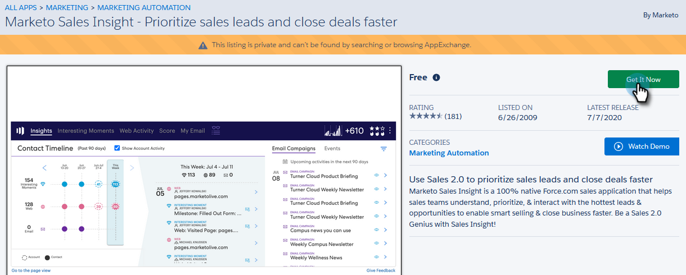

# Installera Marketo Sales Insight-paket i Salesforce AppExchange {#install-marketo-sales-insight-package-in-salesforce-appexchange}

Du måste installera Marketo Sales Insight-appen i din Salesforce-prenumeration innan du kan använda alla goda funktioner som Sales Insight erbjuder. Så här gör du.

>[!NOTE]
>
>**Administratörsbehörigheter krävs**

>[!NOTE]
>
>Marketo Sales Insight är kompatibelt med Salesforce Platform (Shield) Encryption.

1. Gå till sidan [AppExchange för Marketo Sales Insight](http://appexchange.salesforce.com/listingDetail?listingId=a0N30000001SVZmEAO) och klicka på **Get it Now**.

   

1. Klicka på **Logga in på AppExchange** och logga in med dina Salesforce-inloggningsuppgifter.
1. Ange ditt anslutna Salesforce-kontoinloggning och klicka på **Installera i produktion**.

   

   >[!TIP]
   >
   >Om du vill testa den i sandlådan först väljer du **Installera i sandlådan**.

1. Läs och godkänn villkoren och klicka sedan på** Bekräfta och installera**.

   

1. Du kan välja Installera endast för administratörer (och ge MSI-åtkomst till specifika profiler senare), Installera för alla användare eller Installera för specifika profiler.

   

1. Du kan se följande meddelande när du har startat installationsprocessen. Du får ett mejl när installationen är klar. Klicka på **Klar** för att stänga.

   

1. Kontrollera att** Marketo Sales Insight** finns i de installerade paketen.

   

1. Klicka på **Konfigurera** bredvid ditt namn.

   

1. Sök efter&quot;objekt&quot; och klicka sedan på **Objekt** under **Skapa**.

   

1. Kontrollera att **Distribuerad** är markerat för alla Marketo Sales Insight-artiklar.

   

1. Om ett objekt inte distribueras klickar du på **Redigera **bredvid objektet.

   

1. Under **Distributionsstatus** väljer du **Distribuerad** och klickar på **Spara**.

   

Bra jobbat! Nu har du installerat och driftsatt Marketo Sales Insight. Konfigurera den för säljteamet och se hur försäljningen går framåt.

>[!MORELIKETHIS]
>
>[Konfigurera Marketo Sales Insight i Salesforce Professional Edition](../../../../product-docs/marketo-sales-insight/msi-for-salesforce/configuration/configure-marketo-sales-insight-in-salesforce-professional-edition.md)
>
>[Konfigurera Marketo Sales Insight i Salesforce Enterprise/Unlimited](../../../../product-docs/marketo-sales-insight/msi-for-salesforce/configuration/configure-marketo-sales-insight-in-salesforce-enterprise-unlimited.md)

