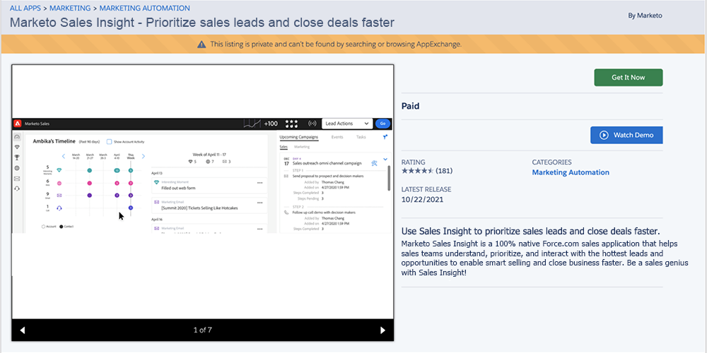

# Installera Marketo Sales Insight-paket i Salesforce AppExchange {#install-marketo-sales-insight-package-in-salesforce-appexchange}

Du måste installera Marketo Sales Insight-appen i din Salesforce-prenumeration innan du kan använda alla goda funktioner som Sales Insight erbjuder. Så här gör du.

>[!NOTE]
>
>**Administratörsbehörigheter krävs**

>[!NOTE]
>
>Marketo Sales Insight är kompatibelt med Salesforce Platform (Shield) Encryption.

1. Gå till [AppExchange page for Marketo Sales Insight](https://appexchange.salesforce.com/listingDetail?listingId=a0N30000001SVZmEAO) och klicka **Hämta nu**.

   

1. Klicka **Logga in på AppExchange** och logga in med dina Salesforce-inloggningsuppgifter.

1. Ange ditt anslutna Salesforce-kontoinloggning och klicka på **Installera i produktion**.

   

   >[!TIP]
   >
   >Om du först vill testa den i din sandlåda väljer du **Installera i sandlåda**.

1. Läs och godkänn villkoren och klicka sedan på **Bekräfta och installera**.

   

1. Du kan välja Installera endast för administratörer (och ge MSI-åtkomst till specifika profiler senare), Installera för alla användare eller Installera för specifika profiler.

   

1. Du kan se följande meddelande när du har startat installationsprocessen. Du får ett mejl när installationen är klar. Klicka **Klar** för att stänga.

   

1. Verifiera att **Marketo Sales Insight** finns i installerade paket.

   

1. Klicka **Inställningar** bredvid ditt namn.

   

1. Sök efter&quot;objekt&quot; och klicka sedan på **Objekt** under **Skapa**.

   

1. Dubbelkontrollera det **Distribuerad** är markerad för alla Marketo Sales Insight-artiklar.

   

1. Om ett objekt inte distribueras klickar du på **Redigera** bredvid objektet.

   

1. Under **Distributionsstatus** avsnitt, markera **Distribuerad** och klicka **Spara**.

   

Bra jobbat! Nu har du installerat och driftsatt Marketo Sales Insight. Konfigurera den för säljteamet och se hur försäljningen går framåt.

>[!MORELIKETHIS]
>
>* [Konfigurera Marketo Sales Insight i Salesforce Professional Edition](/help/marketo/product-docs/marketo-sales-insight/msi-for-salesforce/configuration/configure-marketo-sales-insight-in-salesforce-professional-edition.md)
>* [Konfigurera Marketo Sales Insight i Salesforce Enterprise/Unlimited](/help/marketo/product-docs/marketo-sales-insight/msi-for-salesforce/configuration/configure-marketo-sales-insight-in-salesforce-enterprise-unlimited.md)
>* [Lägg till åtkomst till profiler för Sales Insight](/help/marketo/product-docs/marketo-sales-insight/msi-for-salesforce/configuration/add-sales-insight-access-to-profiles.md){target=&quot;_blank&quot;}

