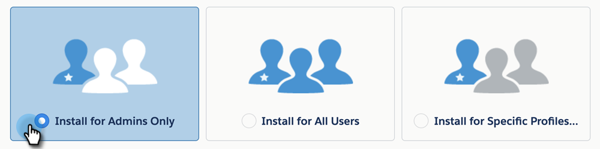
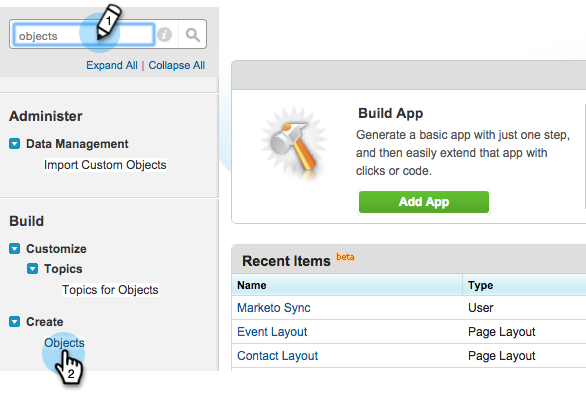

# Installera [!DNL Marketo Sales Insight]-paketet i [!DNL Salesforce] AppExchange {#install-marketo-sales-insight-package-in-salesforce-appexchange}

Du måste installera appen [!DNL Marketo Sales Insight] i din [!DNL Salesforce]-prenumeration innan du kan utnyttja allt som finns i [!DNL Sales Insight]. Så här gör du.

>[!NOTE]
>
>**Administratörsbehörigheter krävs**

>[!NOTE]
>
>[!DNL Marketo Sales Insight] är kompatibelt med [!DNL Salesforce] Platform (Shield)-kryptering.

1. Gå till [AppExchange-sidan för  [!DNL Marketo Sales Insight]](https://appexchange.salesforce.com/listingDetail?listingId=a0N30000001SVZmEAO) och klicka på **[!UICONTROL Get it Now]**.

   

1. Klicka på knappen **[!UICONTROL Log in to the AppExchange]** och logga in med dina [!DNL Salesforce]-inloggningsuppgifter.

1. Ange ditt anslutna [!DNL Salesforce]-kontoinloggning och klicka på **[!UICONTROL Install in Production]**.

   

   >[!TIP]
   >
   >Om du vill testa den i din sandlåda först väljer du **[!UICONTROL Install in Sandbox]**.

1. Läs och godkänn villkoren och klicka sedan på **[!UICONTROL Confirm and Install]**.

   

1. Du kan välja att [!UICONTROL Install for Admins Only] (och ge MSI-åtkomst till specifika profiler senare), [!UICONTROL Install for All Users] eller [!UICONTROL Install for Specific Profiles].

   

1. Du kan se följande meddelande när du har startat installationsprocessen. Du får ett mejl när installationen är klar. Klicka på **Klar** för att stänga.

   

1. Kontrollera att **[!UICONTROL Marketo Sales Insight]** finns i installerade paket.

   

1. Klicka på **[!UICONTROL Setup]** bredvid ditt namn.

   

1. Sök efter [!UICONTROL objects] och klicka sedan på **[!UICONTROL Objects]** under **[!UICONTROL Create]**.

   

1. Dubbelkontrollera att **[!UICONTROL Deployed]** har kontrollerats för alla [!DNL Marketo Sales Insight] objekt.

   

1. Om ett objekt inte har distribuerats klickar du på **[!UICONTROL Edit]** bredvid objektet.

   

1. Under avsnittet **[!UICONTROL Deployment Status]** väljer du **[!UICONTROL Deployed]** och klickar på **[!UICONTROL Save]**.

   

Snyggt jobb! Nu har du installerat och distribuerat [!DNL Marketo Sales Insight]. Konfigurera den för säljteamet och se hur försäljningen går framåt.

>[!MORELIKETHIS]
>
>* [Konfigurera [!DNL Marketo Sales Insight] i [!DNL Salesforce] Professional Edition](/help/marketo/product-docs/marketo-sales-insight/msi-for-salesforce/configuration/configure-marketo-sales-insight-in-salesforce-professional-edition.md)
>* [Konfigurera [!DNL Marketo Sales Insight] i [!DNL Salesforce] Enterprise/Unlimited](/help/marketo/product-docs/marketo-sales-insight/msi-for-salesforce/configuration/configure-marketo-sales-insight-in-salesforce-enterprise-unlimited.md)
>* [Lägg till åtkomst till profiler för Sales Insight](/help/marketo/product-docs/marketo-sales-insight/msi-for-salesforce/configuration/add-sales-insight-access-to-profiles.md){target="_blank"}
