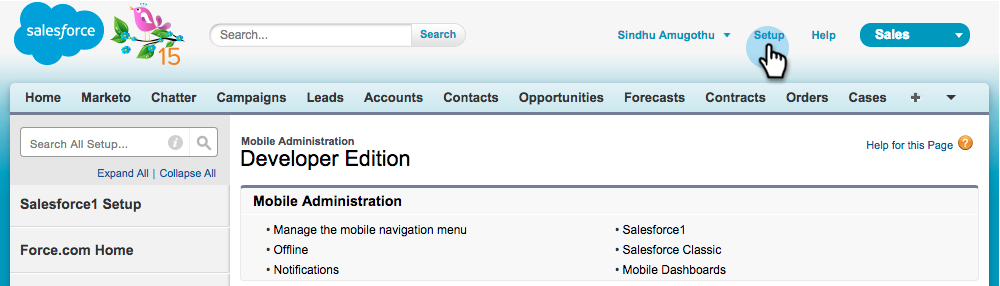
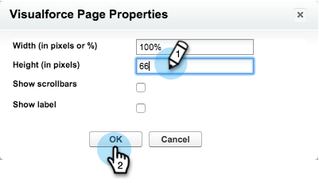

# Installera och konfigurera Marketo Sales Insight i Salesforce1 {#install-and-configure-marketo-sales-insight-in-salesforce}

>[!NOTE]
>
>**Påminnelse**
>
>Befintliga kunder, [uppgradera ditt MSI-paket](http://docs.marketo.com/x/_gU6Ag) innan du fortsätter!

>[!NOTE]
>
>**Förutsättningar**
>
>Om du har Salesforce Enterprise/Unlimited:
>
>* [Steg 1 av 3: Lägg till Marketo-fält i Salesforce (Enterprise/Unlimited)](../../../../product-docs/crm-sync/salesforce-sync/setup/enterprise-unlimited-edition/step-1-of-3-add-marketo-fields-to-salesforce-enterprise-unlimited.md)
>* [Steg 2 av 3: Skapa en Salesforce-användare för Marketo (Enterprise/Unlimited)](../../../../product-docs/crm-sync/salesforce-sync/setup/enterprise-unlimited-edition/step-2-of-3-create-a-salesforce-user-for-marketo-enterprise-unlimited.md)
>* [Steg 3 av 3: Connect Marketo och Salesforce (Enterprise/Unlimited)](../../../../product-docs/crm-sync/salesforce-sync/setup/enterprise-unlimited-edition/step-3-of-3-connect-marketo-and-salesforce-enterprise-unlimited.md)
>* [Konfigurera Marketo Sales Insight i Salesforce Enterprise/Unlimited](../../../../product-docs/marketo-sales-insight/msi-for-salesforce/configuration/configure-marketo-sales-insight-in-salesforce-enterprise-unlimited.md)

>
>
Om du har Salesforce Professional:
>
>* [Konfigurera Marketo Sales Insight i Salesforce Professional Edition](../../../../product-docs/marketo-sales-insight/msi-for-salesforce/configuration/configure-marketo-sales-insight-in-salesforce-professional-edition.md)

>

>[!NOTE]
>
>Marketo Sales Insight in Salesforce1 includes: Bästa val, Lead Feed, Intressant ögonblick och Lägg till i Marketo Campaign.

1. Aktivera Salesforce1-mobilappen
1. Klicka på **Konfigurera** och sedan **Mobiladministration**.

   

1. Klicka på **Salesforce1**.

   

1. Klicka på **Salesforce1 Settings**.

   

1. Klicka på **Enable the Salesforce1 mobile browser app**.

   

1. Klicka på **Spara**.

   

1. Välj **Mobiladministration**.

   

1. Klicka på **Hantera mobil navigeringsmeny**.

   

1. Välj **Marketo **och **Lägg till **det till menyalternativen **Markerad **Lägg till **det.

   

1. Välj **Marketo**, flytta den **Uppåt **till önskat område och klicka på **Spara**.

   

1. Dölj föråldrad markering till anpassat objekt
1. Klicka på **Konfigurera**.

   

1. Välj **Hantera användare**.

   

1. Välj **Profiler**.

   

1. Klicka för att **redigera **valfri profil.

   

1. Under **Tabbinställningar** väljer du den *första* **markeringen**.

   ** 

   **

1. Välj **Dold** flik.

   ** 

   **

   >[!NOTE]
   >
   >Se till att du döljer Marketo-fliken för alla önskade profiler.

1. Anpassa flikar
1. Klicka** +**.

   

1. Klicka på **Anpassa mina flikar**.

   

1. Välj **Marketo** och **Lägg till **det på de markerade flikarna.

   

1. Välj **Marketo**, flytta den **Uppåt **till önskat område och klicka på **Spara**.

   

1. Anpassa sidlayouter
1. Klicka på **Konfigurera**.

   

1. Klicka på **Konfigurera**, skriv **Sidlayouter** och klicka på **Sidlayouter** under Leads.

   >[!NOTE]
   >
   >Upprepa stegen för alla sidlayouter som används i organisationen (marknadsföring, försäljning, osv.) för objekten Kontakt, Konto och säljprojekt.

   

1. Klicka på **Redigera** om du vill göra ändringar i lead-layouten.

   

1. Klicka på **Visualforce-sidor **och dra** sedan Lead Mobile **till avsnittet Mobilkort.

   

1. Ändra höjden till 66 och klicka på **OK**.

   

1. Klicka på **Fält** och dra **Lägg till i Marketo Campaign **till** Marketo Sales Insight **avsnittet.

   

   >[!TIP]
   >
   >Skriv&quot;Lägg till i&quot; i snabbsökningen för att göra det enkelt att hitta Lägg till i Marketo Campaign.

1. Klicka på **Spara**.

   

Phew! Du har nu installerat Marketo Sales Insight för Salesforce1! Ge dig själv en klapp på baksidan.

>[!NOTE]
>
>**Relaterade artiklar**
>
>* [Bästa val i Salesforce1](best-bets-in-salesforce1.md)
>* [Intressanta stunder i Salesforce1](interesting-moments-in-salesforce1.md)
>* [Skicka Marketo-åtgärder för e-post och kampanj och bevakning i Salesforce1](send-marketo-email-and-campaign-and-watchlist-actions-in-salesforce1.md)

>

