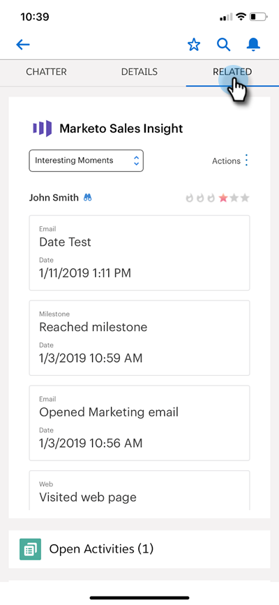

# Intressanta stunder i [!DNL Salesforce1] {#interesting-moments-in-salesforce}

[Att använda intressanta stunder](/help/marketo/product-docs/marketo-sales-insight/msi-for-salesforce/features/tabs-in-the-msi-panel/interesting-moments/using-interesting-moments.md) är nyckeln till att kommunicera med säljarna via appen Marketo Sales Insight. Med [!DNL Marketo Sales Insight] för [!DNL Salesforce1] kan du göra samma sak med din smarttelefon!

>[!AVAILABILITY]
>
>Dessa är endast tillgängliga för [!DNL Marketo Sales Insight] kunder.

1. Öppna appen [!DNL Salesforce] på din smarttelefon.

1. Navigera till en lead.

   

1. Klicka på fliken **[!UICONTROL Related]** för att visa Intressanta ögonblick, webbaktivitet, e-post och poäng.

   

>[!MORELIKETHIS]
>
>* [Intressant stund](/help/marketo/product-docs/core-marketo-concepts/smart-campaigns/flow-actions/interesting-moment.md)
>* [Tokens för intressanta ögonblick](/help/marketo/product-docs/marketo-sales-insight/msi-for-salesforce/features/tabs-in-the-msi-panel/interesting-moments/trigger-tokens-for-interesting-moments.md)
