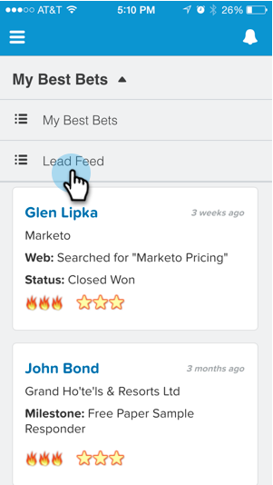

# Visa lead-feed i [!DNL Salesforce1] {#seeing-lead-feed-in-salesforce}

Ledningsmataren är en uppdaterad lista över intressanta händelser som har utförts av dina leads.

1. Gå till området **Marketo** i [!DNL Salesforce1].

   

1. Tryck på nedpilen.

   

1. Tryck på **[!UICONTROL Lead Feed]**.

   

   Perfekt! Nu vet du hur du kommer till din lead-feed!

   

>[!MORELIKETHIS]
>
>* [Intressanta stunder i [!DNL Salesforce1]](/help/marketo/product-docs/marketo-sales-insight/msi-for-salesforce/msi-for-mobile/interesting-moments-in-salesforce1.md)
>* [Skicka Marketo-åtgärder för e-post och kampanj och bevakning i [!DNL Salesforce1]](/help/marketo/product-docs/marketo-sales-insight/msi-for-salesforce/msi-for-mobile/send-marketo-email-and-campaign-and-watchlist-actions-in-salesforce1.md)
>* [[!DNL Best Bets] in [!DNL Salesforce1]](/help/marketo/product-docs/marketo-sales-insight/msi-for-salesforce/msi-for-mobile/best-bets-in-salesforce1.md)
