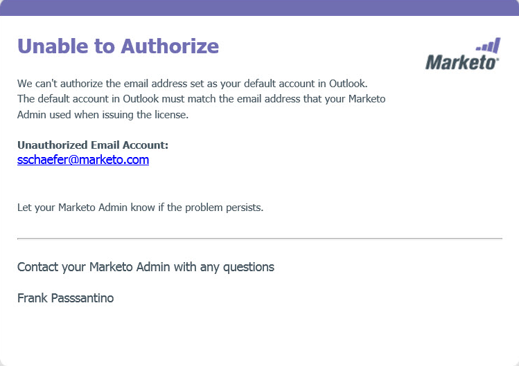

# Auktorisera Marketo Outlook-plugin {#authorize-the-marketo-outlook-plugin}

Om du vill använda Marketo MSI-plugin i Outlook måste du godkänna det.

>[!PREREQUISITES]
>
>Plugin-programmet måste vara installerat och du måste ha behörighet som plugin-användare av Marketo Admin.

1. Klicka på någon av meddelandeknapparna i Marketo.

   

1. När dialogrutan Authorize Marketo Plugin visas klickar du på **Begärandekod**.

   

1. Koden skickas till din standarde-postadress för Outlook-kontot.

   

1. Om e-postadressen för ditt standardkonto i Outlook checkas ut får du en registreringsnyckel. Ange det i popup-fönstret och klicka på **Skicka**.

   

   >[!NOTE]
   >
   >Registreringskoden **upphör att gälla efter 14 dagar.**

1. Om e-postadressen inte är auktoriserad får du detta mindre glada e-postmeddelande. Kontakta din Marketo-administratör för att lösa problemet.

   
