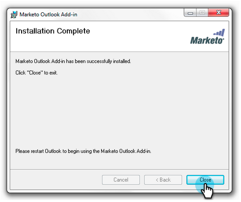

# Installera Marketo-e-posttillägget för Outlook med registreringskoden {#install-the-marketo-email-add-in-for-outlook-with-a-registration-code}

Om användarna har tillgång till administratörsinställningarna på sina bärbara datorer kan du skicka en registreringskod direkt till dem.

Om du inte har fått någon inbjudan via e-post ber du Marketo-administratören att bjuda in dig.

>[!PREREQUISITES]
>
>* Du måste vara [utfärdad en Marketo Email-tilläggslicens](issue-a-marketo-email-add-in-license.md).

>

## Hämta installationsprogrammet {#download-installer}

1. Identifiera din [Microsoft Outlook-version](http://support.office.com/en-us/article/what-version-of-outlook-do-i-have-b3a9568c-edb5-42b9-9825-d48d82b2257c)
1. Klicka på länken om du vill hämta det installationsprogram som passar din version av Microsoft Outlook.

   >[!NOTE]
   >
   >Länkarna nedan fungerar för närvarande bara i Chrome. Vi beklagar eventuella besvär.

   | Outlook-version | 32-bitars Outlook | 64-bitars Outlook |
   |---|---|---|
   | Outlook 2000 | Stöds inte | Ej tillämpligt |
   | Outlook 2003 | [Hämta](http://munchkin.marketo.net/MarketoAddInSetup32.msi) | Ej tillämpligt |
   | Outlook 2007 | [Hämta](http://munchkin.marketo.net/MarketoAddInSetup32.msi) | Ej tillämpligt |
   | Outlook 2010 | [Hämta](http://munchkin.marketo.net/MarketoAddInSetup32.msi) | [Hämta](http://munchkin.marketo.net/MarketoAddInSetup64.msi) |
   | Outlook 2013 | [Hämta](http://munchkin.marketo.net/MarketoAddInSetup32.msi) | [Hämta](http://munchkin.marketo.net/MarketoAddInSetup64.msi) |
   | Outlook 2016 | [Hämta](http://munchkin.marketo.net/MarketoAddInSetup32.msi) | [Hämta](http://munchkin.marketo.net/MarketoAddInSetup64.msi) |
   | Outlook 2019 | [Hämta](http://munchkin.marketo.net/MarketoAddInSetup32.msi) | [Hämta](http://munchkin.marketo.net/MarketoAddInSetup64.msi) |
   | Outlook O365 (endast Windows) | [Hämta](http://munchkin.marketo.net/MarketoAddInSetup32.msi) | [Hämta](http://munchkin.marketo.net/MarketoAddInSetup64.msi) |
   | Outlook för Mac | Stöds inte | Stöds inte |
   | Outlook Web App | Stöds inte | Stöds inte |

## Kopiera din registreringskod {#copy-your-registration-code}

1. Kopiera registreringskoden från det inbjudningsmejl du fick.

   

1. Stäng Microsoft Outlook.

   

## Installera {#install}

1. Kör installationsprogrammet.

   

   >[!NOTE]
   >
   >Om du får en säkerhetsvarning, oroa dig inte! Klicka bara på **Kör**.

1. Klicka på **Nästa**.

   

1. Fyll i **Förnamn**, **Efternamn**, **E-postadress**, kopiera och klistra sedan in **Registreringskoden **från e-postmeddelandet i formuläret och klicka på **Nästa**.

   

   >[!TIP]
   >
   >Om installationen misslyckas bör du kontakta din IT-avdelning för att kontrollera att HTTPS-trafik inte blockeras. Installationsprogrammet kräver att HTTPS-trafik är öppen.

1. Klicka på** Nästa* för att installera på standardplatsen.

   

1. Klicka på **Nästa**.

   

   >[!NOTE]
   >
   >Om du får en säkerhetsfråga om en okänd utgivare klickar du på **Ja**.

1. Installationen är nu klar, klicka på **Stäng**.

   

1. Öppna nu Microsoft Outlook och se Marketo-knapparna.

   

   Underbar! Nu är Marketo-knapparna på en bättre plats.

Läs mer om hur du använder åtgärderna Marketo Message och Log With Marketo.

>[!MORELIKETHIS]
>
>* [Skicka och spåra ett e-postmeddelande med tillägget Marketo Email för Outlook](send-and-track-an-email-with-the-email-add-in-for-outlook.md)
>* [Skicka och spåra från Outlook med en Marketo-mall](send-and-track-from-outlook-using-a-marketo-template.md)

>

