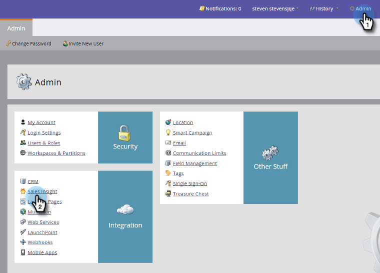

# Utfärda en Marketo E-post-tilläggslicens {#issue-a-marketo-email-add-in-license}

Alla som vill använda tillägget Marketo Email Outlook måste först få en licens. Det finns två sätt att tillhandahålla licensen.

* **[Installation](install-the-marketo-add-in-for-outlook-with-an-enterprise-key.md)** av företagsnyckel: Använd den här metoden när säljarna inte har administratörsbehörighet för sina bärbara företagsdatorer och inte kan installera plugin-program, programvara osv. på den. I det här fallet utfärdar Marketo Admin licenser till en lista över behöriga användare. Sedan fjärrdistribuerar IT-teamet plugin-programmet till alla behöriga användares datorer med hjälp av Enterprise Key. Plugin-användaren godkänner det sedan.
* **[Installation](install-the-marketo-email-add-in-for-outlook-with-a-registration-code.md)** av registreringskod: Använd den här metoden när säljarna har administratörsrättigheter för sin bärbara företagsdator och kan installera plugin-program, programvara osv. på den. Under den här processen utfärdar Marketo-administratören licenser till en lista över behöriga användare och skickar dem e-postmeddelanden direkt med nedladdningslänkar. Säljaren får ett mejl med en nedladdningslänk och en unik registrerings-URL.

>[!NOTE]
>
>**Tillgänglighet**
>
>Alla kunder har inte köpt den här funktionen. Kontakta din säljare för mer information.

>[!NOTE]
>
>**Administratörsbehörigheter krävs**

1. I My Marketo klickar du på Admin och sedan Sales Insight.

1. Klicka på **Utfärda licens** på fliken **E-posttillägg **.

   

1. Ange säljarnas e-postadresser som måste ha behörighet att använda plugin-programmet och klicka på **Utfärda licens**.

   >

   >[!TIP]
   >
   >Du kan ange flera e-postadresser, avgränsade med kommatecken.

   >[!NOTE]
   >
   >Om du vill installera plugin-programmet på fjärrbasis, låter du kryssrutan vara avmarkerad och skickar din IT-personal din [företagsnyckel](http://docs.marketo.com/display/DOCS/Install+the+Marketo+Add-in+for+Outlook+with+an+Enterprise+Key).
   >
   >Om säljarna har administratörsåtkomst till sina datorer markerar du kryssrutan så är du klar!

>[!NOTE]
>
>**Relaterade artiklar**
>
>* [Installera Marketo-tillägget för Outlook med en företagsnyckel](install-the-marketo-add-in-for-outlook-with-an-enterprise-key.md)
>* [Installera Marketo-e-posttillägget för Outlook med en registreringskod](install-the-marketo-email-add-in-for-outlook-with-a-registration-code.md)
>* [Uppgradera ditt Marketo-e-posttillägg för Outlook](upgrade-your-marketo-email-add-in-for-outlook.md)

