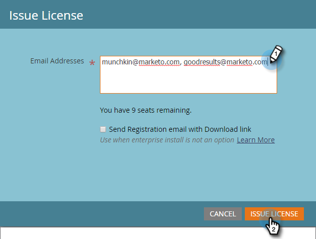

# Utfärda en Marketo e-posttilläggslicens {#issue-a-marketo-email-add-in-license}

Alla som vill använda Marketo-tillägget för e-post [!DNL Outlook] måste först få en licens. Det finns två sätt att tillhandahålla licensen.

* **[Installation av företagsnyckel](/help/marketo/product-docs/marketo-sales-insight/msi-outlook-plugin/install-the-marketo-add-in-for-outlook-with-an-enterprise-key.md)**: Använd den här metoden när säljarna inte har administratörsbehörighet för sina bärbara företagsdatorer och inte kan installera plugin-program, programvara osv. på den. I det här fallet utfärdar Marketo Admin licenser till en lista över behöriga användare. Sedan fjärrdistribuerar IT-teamet plugin-programmet till alla behöriga användares datorer med hjälp av Enterprise Key. Plugin-användaren godkänner det sedan.
* **[Installation av registreringskod](/help/marketo/product-docs/marketo-sales-insight/msi-outlook-plugin/install-the-marketo-email-add-in-for-outlook-with-a-registration-code.md)**: Använd den här metoden när säljarna har administratörsbehörighet för sin bärbara företagsdator och kan installera plugin-program, programvara osv. på den. Under den här processen utfärdar Marketo-administratören licenser till en lista över behöriga användare och skickar dem e-postmeddelanden direkt med nedladdningslänkar. Säljaren får ett mejl med en nedladdningslänk och en unik registrerings-URL.

>[!AVAILABILITY]
>
>Alla Marketo Engage-användare har inte köpt den här funktionen. Kontakta Adobe Account Team (din kontoansvarige) för mer information.

>[!NOTE]
>
>**Administratörsbehörigheter krävs**

1. I Min Marketo klickar du på **[!UICONTROL Admin]** och sedan på **[!UICONTROL Sales Insight]**.

1. Klicka på **[!UICONTROL Email Add-in]** på fliken **[!UICONTROL Issue License]**.

   

1. Ange säljarnas e-postadresser som måste ha behörighet att använda plugin-programmet och klicka på **[!UICONTROL Issue License]**.

   >

   >[!TIP]
   >
   >Du kan ange flera e-postadresser, avgränsade med kommatecken.

   >[!NOTE]
   >
   >Om du vill installera plugin-programmet på fjärrbasis, låter du kryssrutan vara avmarkerad och skickar din [företagsnyckel](/help/marketo/product-docs/marketo-sales-insight/msi-outlook-plugin/install-the-marketo-add-in-for-outlook-with-an-enterprise-key.md) till IT-teamet.
   >
   >Om säljarna har administratörsåtkomst till sina datorer markerar du kryssrutan så är du klar!

>[!MORELIKETHIS]
>
>* [Installera Marketo-tillägget för [!DNL Outlook] med en företagsnyckel](/help/marketo/product-docs/marketo-sales-insight/msi-outlook-plugin/install-the-marketo-add-in-for-outlook-with-an-enterprise-key.md)
>* [Installera Marketo e-posttillägg för [!DNL Outlook] med en registreringskod](/help/marketo/product-docs/marketo-sales-insight/msi-outlook-plugin/install-the-marketo-email-add-in-for-outlook-with-a-registration-code.md)
>* [Uppgradera ditt e-posttillägg för Marketo för [!DNL Outlook]](/help/marketo/product-docs/marketo-sales-insight/msi-outlook-plugin/upgrade-your-marketo-email-add-in-for-outlook.md)
