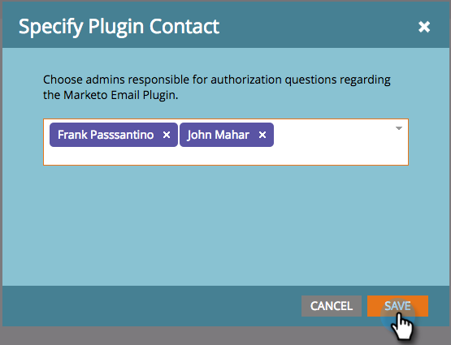

# Ange administratörer för Marketo Sales Insight-plugin {#specify-marketo-sales-insight-plugin-admins}

Du kan ange vilka kontakter som ska visas i det e-postmeddelande som du skickar till användarna när du bjuder in dem att konfigurera MSI i Outlook.

1. I Min Marketo klickar du på **Administratör** och sedan **Försäljningsinsikter**.

   

1. Klicka på **E-posttillägg** -fliken.

   

1. Klicka **Ange kontakt för plugin-program**.

   

1. Klicka för att ange kontakter för plugin-programmet.

   

1. Klicka **Spara**.

   

1. De kontakter du har valt listas i e-postsäljarna under auktoriseringsprocessen.

   

   Perfekt!
