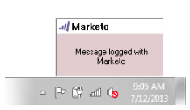

# Logga inkommande e-post från leads i Marketo {#log-inbound-mail-from-your-leads-in-marketo}

Du kan logga svar från dina leads direkt i Outlook med Marketo-tillägget för e-post.

## Från huvudprogrammet i Outlook {#from-the-main-outlook-application}

1. Markera det e-postmeddelande som du vill logga och klicka på Logga med Marketo.

>[!TIP]
>
>Du kan också högerklicka på ett meddelande och klicka på **Logga med markering**.

Du bör se en bekräftelse.

## Från själva e-postmeddelandet {#from-the-email-itself}

Om du har öppnat e-postmeddelandet behöver du bara klicka på knappen Logga med Marketo.

Du bör se samma bekräftelse som den andra metoden.

Logga dina leads svar och lägg till dem i deras historik i Marketo.

>[!NOTE]
>
>**Relaterade artiklar**
>
>* [Skicka och spåra ett e-postmeddelande med tillägget Marketo Email för Outlook](../../../product-docs/marketo-sales-insight/msi-outlook-plugin/send-and-track-an-email-with-the-email-add-in-for-outlook.md)
>* [Skicka och spåra från Outlook med en Marketo-mall](../../../product-docs/marketo-sales-insight/msi-outlook-plugin/send-and-track-from-outlook-using-a-marketo-template.md)

>

