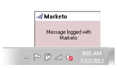

# Logga inkommande e-post från dina leads i Marketo {#log-inbound-mail-from-your-leads-in-marketo}

Du kan logga svar från dina leads direkt i [!DNL Outlook] med Marketo e-posttillägg.

## Från huvudprogrammet [!DNL Outlook] {#from-the-main-outlook-application}

1. Markera det e-postmeddelande som du vill logga och klicka på **[!UICONTROL Log with Marketo]**.

>[!TIP]
>
>Du kan också högerklicka på ett meddelande och klicka på **[!UICONTROL Log With Marketo]**.

Du bör se en bekräftelse.

## Från själva e-postmeddelandet {#from-the-email-itself}

Om du har öppnat e-postmeddelandet kan du bara klicka på knappen **[!UICONTROL Log with Marketo]** därifrån.

Du bör se samma bekräftelse som den andra metoden.

Logga dina leads svar och lägg till dem i deras historik i Marketo.

>[!MORELIKETHIS]
>
>* [Skicka och spåra ett e-postmeddelande med Marketo-tillägget för  [!DNL Outlook]](/help/marketo/product-docs/marketo-sales-insight/msi-outlook-plugin/send-and-track-an-email-with-the-email-add-in-for-outlook.md)
>* [Skicka och spåra från [!DNL Outlook] Använda en Marketo-mall](/help/marketo/product-docs/marketo-sales-insight/msi-outlook-plugin/send-and-track-from-outlook-using-a-marketo-template.md)
