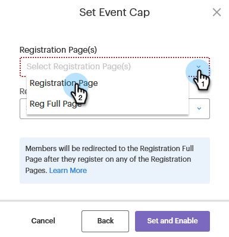

# Ställa in en händelsekarta {#setting-an-event-cap}

Begränsa antalet personer som kan registrera sig för evenemanget med ett händelsetak.

>[!NOTE]
>
>Alla har inte köpt den här funktionen. Kontakta kontoteamet (din kontoansvarige) för mer information.

>[!IMPORTANT]
>Du måste ha minst två godkända landningssidor (en registreringssida och en hel registreringssida) i programmet innan du kan ange ett händelsetak.

>[!NOTE]
>
>Om du vill frigöra utrymme i en händelse måste programmedlemmen tas bort (du kan göra detta genom att uppdatera deras status till Inte i programmet).

1. Välj ett händelsesystem.

   

1. I Översikt finns [!UICONTROL Event Cap] och klicka **[!UICONTROL Not Set]**.

   

1. Ange det maximala antal personer som du vill kunna registrera för din aktivitet och klicka på **[!UICONTROL Next]**.

   

1. Klicka på [!UICONTROL Registration Page] och välj den landningssida som ska fungera som registreringssida.

   

1. Klicka på **[!UICONTROL Registration Full Page]** och välj den landningssida som ska fungera som registreringssida. Klicka **[!UICONTROL Set and Enable]** när det är klart.

   

   Ni är färdiga. Om du bestämmer dig för att du vill redigera informationen om händelseanfangen klickar du på den blå texten bredvid [!UICONTROL Event Cap] och upprepa från steg 3.

   
