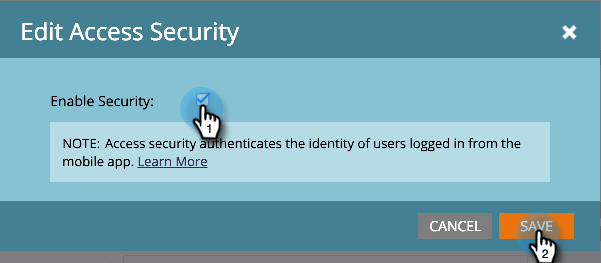

# Autentisera säkerhet för mobil åtkomst {#authenticate-mobile-access-security}

Marketo erbjuder två nya ID:n för att förbättra säkerheten för mobila användare: åtkomstnyckeln och åtkomsthemligheten. Dessa hjälper till att säkerställa att användare som loggar in i ditt program faktiskt är de som de verkar vara.

Om du vill aktivera ID:n måste du skaffa koderna och skicka dem till din IT-avdelning så att de kan skapa en säker matchning.

>[!NOTE]
>
>**Förutsättningar**
>
>Om du vill aktivera den här funktionen kontaktar du supporten och begär Vespa Secure Mode.

1. I Marketo väljer du **Admin **och klickar på **Mobilappar och enheter**.

   

1. Välj den mobilapp som du vill aktivera säker åtkomst för.

   

1. Bläddra nedåt och klicka på **Redigera** i sektionen Åtkomstskydd.

   

1. Markera kryssrutan* Aktivera säkerhet**. Klicka på **Spara**.

   

1. Under Åtkomstskydd visas nu de två nya koderna. Var noga med att skicka dessa till din IT-avdelning.

   

