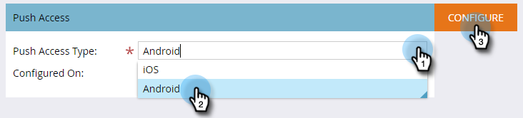

# Konfigurera Android-push-åtkomst för mobilappar {#configure-mobile-app-android-push-access}

1. Klicka på **Admin**.

   

1. Välj **Mobilappar**.

   

   Välj önskad mobilapp.

   

1. Under **Push Access Type** väljer du **Android** och klickar på **Configure.**

   

   >[!NOTE]
   >
   >Du behöver en **server-API-nyckel** och **projektnummer** från din mobilappsutvecklare. Utvecklaren får dessa genom att logga in på Google Play Developer Console för att registrera din app och aktivera molnmeddelanden.

   Ange nyckel för server-API och projektnummer. Klicka på Spara.

   

   Söt. Kontrollera att du har konfigurerat appen med iOS.

>[!MORELIKETHIS]
>
>* [Konfigurera push-åtkomst för iOS-mobilappar](configure-mobile-app-ios-push-access.md)

>

