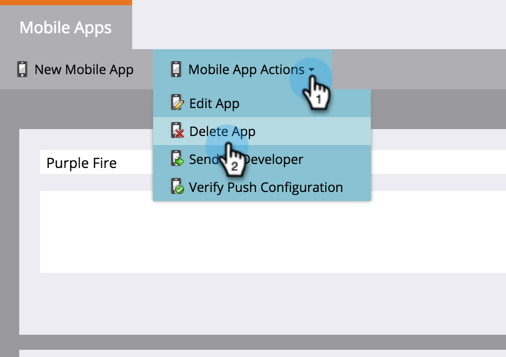

# Ta bort mobilapp {#delete-mobile-app}

1. Klicka på **[!UICONTROL Admin]**.

   

1. Välj **[!UICONTROL Mobile Apps]**.

   

1. Välj önskad mobilapp.

   

1. Klicka på **[!UICONTROL Mobile App Actions]** och välj **[!UICONTROL Delete App]**.

   

1. Bekräfta genom att klicka på **[!UICONTROL Delete]**.

   

Ta-da! Det går inte längre att skicka push-meddelanden från den här mobilappen.
