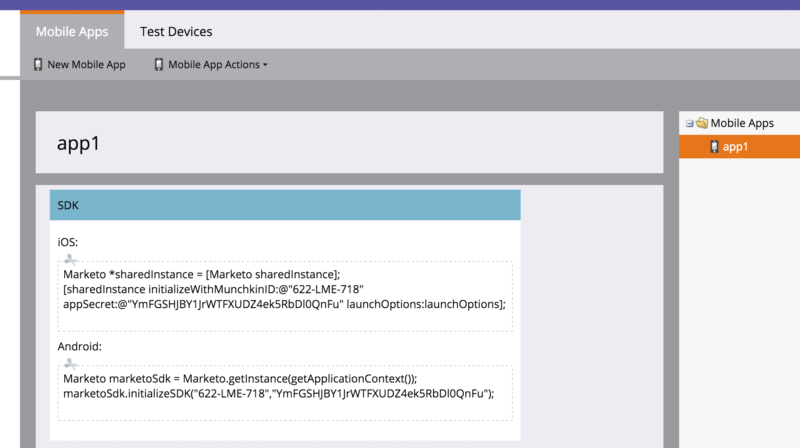

# Skicka SDK-kod till en utvecklare {#send-sdk-code-to-a-developer}

Innan du kan skapa meddelanden i appen eller push-meddelanden måste utvecklaren ha konfigurerat och initierat Mobile App SDK för Android- och iOS-plattformarna.

* [Instruktioner för Android](https://experienceleague.adobe.com/sv/docs/marketo-developer/marketo/mobile/installation#how-to-install-marketo-sdk-on-android)
* [Instruktioner för iOS](https://experienceleague.adobe.com/sv/docs/marketo-developer/marketo/mobile/installation#how-to-install-marketo-sdk-on-ios)

## Skicka SDK-kod till en utvecklare {#send-sdk-code-to-a-developer-1}

Ibland måste en administratör skicka viss SDK-kod till en utvecklare.

Så här gör du.

1. Klicka på **[!UICONTROL Admin]**.

   

1. Välj **[!UICONTROL Mobile Apps]**.

   

1. Välj önskad mobilapp.

   

1. Klicka på **[!UICONTROL Mobile App Actions]** och välj **[!UICONTROL Send to Developer]**.

   

1. Ange en e-postadress och klicka på **[!UICONTROL Send]**.

   

   SDK-koden skickas nu till utvecklaren.
