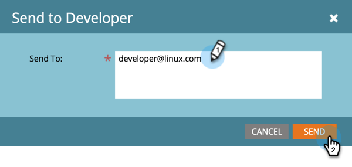

# Skicka SDK-kod till en utvecklare {#send-sdk-code-to-a-developer}

Innan du kan skapa meddelanden i appen eller push-meddelanden måste utvecklaren ha konfigurerat och initierat Mobile App SDK för Android- och iOS-plattformarna.

* [Instruktioner för Android](http://developers.marketo.com/documentation/mobile/installation-instructions-on-android/)
* [Instruktioner för iOS](http://developers.marketo.com/documentation/mobile/installation-instructions-on-ios/)

## Skicka SDK-kod till en utvecklare {#send-sdk-code-to-a-developer-1}

Ibland måste en administratör skicka en del SDK-kod till en utvecklare.

Så här gör du.

1. Klicka på Admin.

   

1. Välj Mobilappar.

   

1. Välj önskad mobilapp.

   

1. Klicka på **Åtgärder för mobilappar** och välj **Skicka till utvecklare**.

   

1. Ange en e-postadress och klicka på **SEND**.

   

   SDK-koden skickas nu till utvecklaren.

