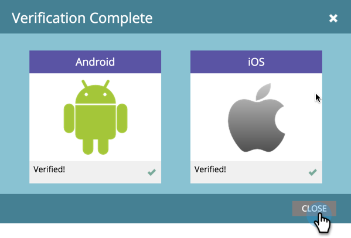

# Verifiera push-konfiguration {#verify-push-configuration}

>[!PREREQUISITES]
>
>Din mobilutvecklare måste ha lagt till Marketo SDK-kod i din mobilapp.

Verifiera push-konfigurationen för att säkerställa att allt är synkat.

1. Klicka på **Administratör**.

   

1. Välj **Mobilappar**.

   

1. Välj önskad mobilapp.

   

1. Klicka **Funktioner för mobilappar** och markera **Verifiera push-konfiguration**.

   

1. Bekräfta att plattformarna lästes och klicka **Stäng**.

   

Klart! Nu kan du börja skicka push-meddelanden.

>[!MORELIKETHIS]
>
>[Skapa ett push-meddelande](/help/marketo/product-docs/mobile-marketing/push-notifications/create-a-push-notification.md)
