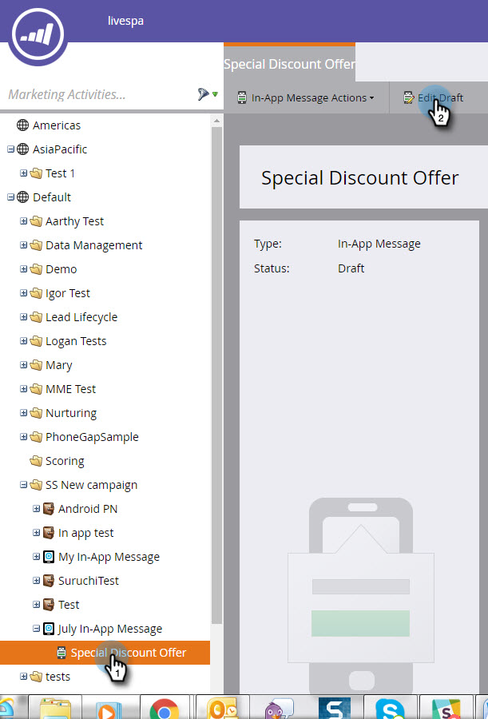
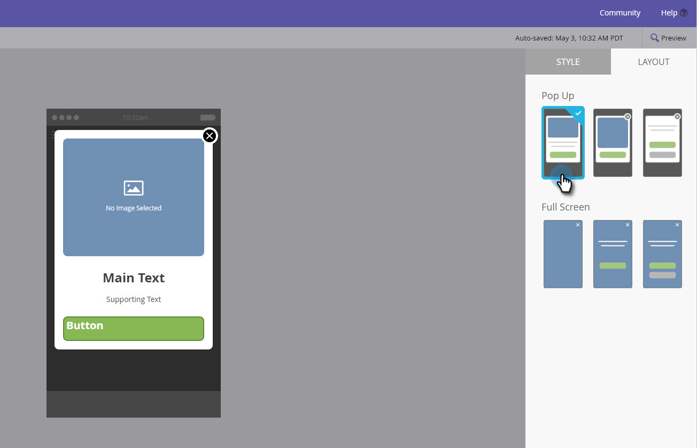
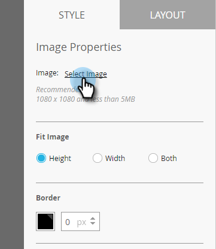

# Lägg till meddelandebilder i appen {#add-in-app-message-images}

Här väljer du och anpassar dina bilder i appen.

1. Markera meddelandet i appen och klicka på **[!UICONTROL Edit Draft]**.

   

1. Välj en av de sex mallarna på fliken Layout. Det finns tre alternativ för popup-fönster och tre för helskärm.

   >[!TIP]
   >
   >Vad är skillnaden mellan mallarna? Se [Välj en layout för ditt meddelande i appen](/help/marketo/product-docs/mobile-marketing/in-app-messages/creating-in-app-messages/choose-a-layout-for-your-in-app-message.md) innan du börjar.

   

1. Klicka på fliken **[!UICONTROL Style]** och klicka på mallens bildområde.

   

1. Klicka på **[!UICONTROL Select Image]**.

   

1. Välj bilden i Design Studio och klicka på **[!UICONTROL Select]**.

   

   >[!NOTE]
   >
   >Bildstorleken är begränsad till 1 440 x 2 560 px och 5 MB.

1. Vill du ändra dig och använda en annan bild? Inga problem. Klicka på **X** bredvid bildens filnamn.

   

1. Klicka på **[!UICONTROL Remove]**. Nu kan du välja en till.

   

1. Med den önskade bilden på plats i [!UICONTROL Image Properties] väljer du en knapp som passar bilden med Höjd, Bredd eller Båda.

   

1. Du kan också använda en bildkant. Standardinställningen är **Av**. Välj först en färg genom att klicka på den eller genom att ange de hexadecimala eller RGB-numeriska värdena i färgväljaren.

   

1. Klicka på pilarna för att ändra kantbredden i pixlar. Den ändras på bilden.

   

1. Välj en hörnradie med reglaget. Välj en position från vänster till höger: 0, 4, 8, 12 eller 16 pixlar. Standardinställningen är 8 pixlar (mitten).

   

1. Välj en marginal (av eller på). **På** är standardinställningen.

   

1. Markera rutan för att definiera en åtgärd för att trycka en bild.

   

1. Det finns en separat åtgärd för varje plattform (se Obs!).

   

1. Klicka på varje listruta för att visa alternativen. Välj en.

   

   >[!NOTE]
   >
   >Om du vill trycka på åtgärder för bilder, knappar eller bakgrunder kan du ange olika åtgärder för Apple- och Android-plattformarna. Djuplänkar hanteras till exempel på olika sätt för Apple och Android. Om ditt meddelande endast ska skickas till den ena plattformen eller den andra ska du lämna den andra i standardinställningen eller välja **[!UICONTROL None]**.

Bra jobbat! Nu är det dags att [skapa texten för ditt meddelande i appen](/help/marketo/product-docs/mobile-marketing/in-app-messages/creating-in-app-messages/create-in-app-message-text.md).

>[!MORELIKETHIS]
>
>* [Förstå meddelanden i appen](/help/marketo/product-docs/mobile-marketing/in-app-messages/understanding-in-app-messages.md)
>* [Välj en layout för ditt meddelande i appen](/help/marketo/product-docs/mobile-marketing/in-app-messages/creating-in-app-messages/choose-a-layout-for-your-in-app-message.md)
