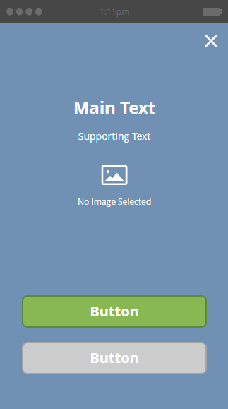

# Välj en layout för ditt meddelande i appen {#choose-a-layout-for-your-in-app-message}

Marketo tillhandahåller sex layouter för att skapa meddelanden i appen.

* Popup-layouter är mer traditionella och perfekta om du inte har ett kreativt team som kan leverera innehåll och du inte behöver ett visst utseende och känsla. Du kan enkelt skapa och redigera dina egna meddelanden i appen i Marketo
* Med helskärmslayouter kan du importera dina egna färdiga designer, vilket ger dig total grafisk flexibilitet

## Popup-layouter {#pop-up-layouts}

De tre popup-layouterna innehåller alla förinställda designelement, inklusive en bild, text, knappar och en bakgrund.

Den första popup-layouten är standardvalet av en bra anledning: Det passar de flesta användningsområden. Det fungerar bra med bilder med låg upplösning. Den här layouten använder standardteckensnitten för din plattform (Helvetica for Apple, Roboto for Android), så den ser alltid bra ut på en telefon eller surfplatta. Du kan överföra och montera huvud- och bakgrundsbilderna, skriva egen huvud- och stödtext samt konfigurera huvud- och stängningsknapparna. Texten är begränsad till tre rader vid 24 pixlar. Större textstorlekar minskar antalet rader.

Den andra layouten för snabbfönster tar bort textrutorna och ger dig mer utrymme för en högre bild. Lägg till text i bilden innan du importerar den, om du vill ha en egen stil.

Den tredje popup-layouten är bra om du inte behöver använda en bild i ditt meddelande i appen. Två knappar ger mottagarna möjlighet att välja mellan olika åtgärder. Texten är begränsad till tre rader. Större textstorlekar minskar antalet tillgängliga rader.

## Helskärmslayouter {#full-screen-layouts}

De tre helskärmslayouterna är utformade för att du ska kunna importera färdiga bilder. Välj dina egna teckensnitt och bädda in dem i bilden så att de matchar alla webbsidor och kampanjer.

Den första helskärmslayouten har en tom arbetsyta. Den visar exakt det du överför, utan att bilden sträcks ut eller beskärs (se exemplet nedan). Den krymper så att den passar, och tomma områden lämnas runt den, beroende på bildformen. Ingen del av bilden tas bort.

Observera att den här vågräta bilden har full bredd och att det tomma utrymmet ovanför och nedanför visas.

Den andra helskärmslayouten lägger till textfält och en knapp.

Till skillnad från den första helskärmslayouten utökas den monterade bilden med den här tillsammans med den tredje helskärmslayouten (nedan) så att den passar helhöjden och sidorna trimmas. Beroende på originalbilden kan det skapa en övertygande bakgrundsbild. I det här exemplet används samma bild som bilden ovan,

Den tredje helskärmslayouten är densamma som den andra, förutom den andra knappen. Detta ger fler alternativ för mottagare av meddelanden.

Nu när du känner till mallarna är det dags att välja en när du [skapar dina bilder](add-in-app-message-images.md)i appen.

>[!MORELIKETHIS]
>
>* [Skapa ett meddelande i appen](http://docs.marketo.com/display/docs/create+an+in-app+message)
>* [Förstå meddelanden i appen](../../../../product-docs/mobile-marketing/in-app-messages/understanding-in-app-messages.md)

>

