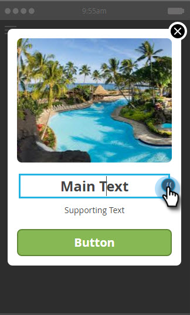

# Skapa meddelandetext i appen {#create-in-app-message-text}

Klicka på textområdet om du vill arbeta med textformatet och innehållet.

1. Klicka på huvudtexten om du vill redigera den infogade texten.

   

1. Välj textfärgen genom att klicka på den eller ange Hex- eller RGB-värdena i färgväljaren.

   

1. Klicka på pilarna för att välja en textstorlek.

   

   >[!CAUTION]
   >
   >För stor textstorlek kan medföra att innehållet flyttas förbi de maximala tre synliga textraderna.

1. Välj en valfri teckenstil för betoning: **Fet**, *kursiv* eller Understruken.

   

1. Välj textjustering: Vänster, Centrerad, Höger. Centrerad är standard.

   

   >[!NOTE]
   >
   >Det teckensnitt som återges i annonsen är standardteckensnittet för varje plattform: Helvetica for Apple and Roboto for Android

1. Markera rutan för att välja åtgärd för att trycka på text.

   

1. Välj en tryckåtgärd för varje plattform: Apple eller Android.

   

   >[!NOTE]
   >
   >För tryckningsåtgärder kan du ställa in olika åtgärder för Apple- och Android-plattformar. Djuplänkar hanteras till exempel på olika sätt för Apple och Android. Om ditt meddelande endast ska visas på en plattform eller på en annan, kan du lämna den andra i standardinställningen eller välja Ingen.

1. Klicka på stödtexten för att redigera den. Det fungerar på samma sätt som att redigera huvudtexten, men standardtextstorleken är mindre.

   

1. Klicka på ikonen Token för att lägga till en token för antingen huvudtexten eller stödtexten.

   

1. Välj en Min token i listrutan, lägg till ett standardvärde och klicka på **Infoga**.

   

   >[!NOTE]
   >
   >Endast Mina token är tillgängliga som alternativ. Om inga Mina token har konfigurerats i programmet är listrutan Token tom.

   >[!TIP]
   >
   >Se till att du tar hänsyn till hur lång teckenlängd en variabel kan resultera i när den visas av din målgrupp. Lämna tillräckligt med utrymme för att ta hänsyn till potentiellt längre värden för att förhindra att de skärs av.

   Ändringar som du gör i token som används i ett godkänt meddelandeprogram i appen börjar inte gälla i meddelandet i appen förrän programmet pausas och sedan återupptas.

Du är guld. Därefter måste du [konfigurera meddelandeknappen](set-up-the-in-app-message-button.md)i appen.

>[!NOTE]
>
>**Relaterade artiklar**
>
>* [Förstå meddelanden i appen](../../../../product-docs/mobile-marketing/in-app-messages/understanding-in-app-messages.md)
>* [Välj en layout för ditt meddelande i appen](choose-a-layout-for-your-in-app-message.md)

>

