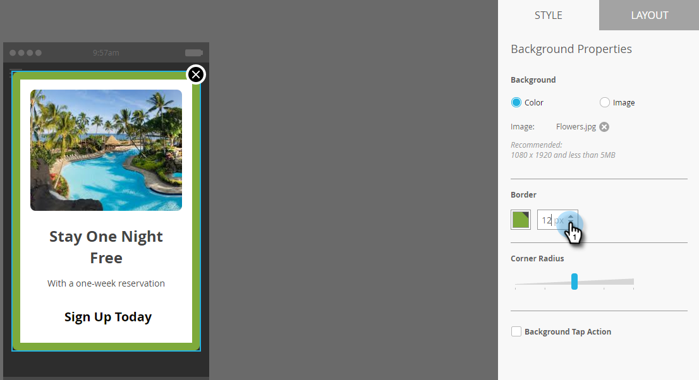

# Konfigurera meddelandebakgrunden i programmet {#set-up-the-in-app-message-background}

Att välja en meddelandebakgrund är ett viktigt steg när du vill avsluta ditt meddelande i appen.

>[!TIP]
>
>För bakgrundsbilder fungerar texturer och övertoningar vanligen bäst.

1. Klicka på bakgrundsområdet i redigeraren.

   

1. Om du vill ange en färg klickar du på **Färg** och sedan på färgmarkeringsrutan. Markera färgen genom att klicka på den eller ange Hex- eller RGB-koderna i färgväljaren.

   

   >[!NOTE]
   >
   >Vanligtvis är vitt som standard en vinnare.

1. Om du vill använda en bakgrund klickar du på **Bild** och sedan på länken **Välj bild** .

   

1. Välj bland filer som överförts till Design Studio. Klicka på **Välj**.

   

   >[!NOTE]
   >
   >Bildstorleken är begränsad till 1 440 x 2 560 px och 5 MB.

1. Utvärdera resultaten. Oj, en ren färg, textur eller övertoning fungerar bättre!

   

1. Använd en valfri bildkant. Standardinställningen är **Av**. Markera först färgen genom att klicka på den eller genom att ange Hex- eller RGB-värdena i färgväljaren.

   

1. Klicka på pilarna för att ändra kantbredden. Denna 12 pixlar breda gröna kant ändrar utseendet på meddelandet i appen.

   

1. Välj en hörnradie med reglaget. Välj en position från vänster till höger: 0, 4, 8, 12 eller 16 pixlar. Standardinställningen är 8 pixlar (mitten).

   

1. Markera kryssrutan för att ange åtgärd för att trycka på bakgrunden (av som standard).

   

   >[!NOTE]
   >
   >För krysåtgärder för bakgrunder kan du ange olika åtgärder för Apple- och Android-plattformar. Djuplänkar hanteras till exempel på olika sätt för Apple och Android. Om ditt meddelande endast ska visas på en plattform eller på en annan, låter du den andra vara kvar i standardinställningen eller väljer **Ingen**.

   [konfigurera knappen Stäng](set-up-the-dismiss-button-and-approve-the-message.md)

   >[!NOTE]
   >
   >**Relaterade artiklar**
   >
   >    
   >    
   >    * [Förstå meddelanden i appen](../../../../product-docs/mobile-marketing/in-app-messages/understanding-in-app-messages.md)
   >    * [Skicka ett meddelande i appen](http://docs.marketo.com/pages/viewpage.action?pageid=10617378)
   >    * [Välj en layout för ditt meddelande i appen](choose-a-layout-for-your-in-app-message.md)

Slutför jobbet genom att gå till .