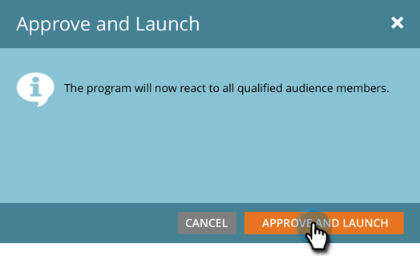

# Godkänn ditt meddelande i appen {#approve-your-in-app-message}

Du måste godkänna sändningen innan meddelandet i appen skickas.

1. Om allt ser bra ut klickar du på **Godkänn och starta**.

   

   >[!NOTE]
   >
   >Om någon del av sändningsprocessen är ofullständig, till exempel om meddelandet i appen inte godkänns, visas ett varningsmeddelande som anger vilket område som behöver uppmärksammas. Åtgärda problemet så ser du meddelandet i steg 2.

1. Klicka på **Godkänn och starta**.

   

1. Om du har använt anpassade fält kan det ta längre tid att köra Marketo och meddelandet visas i stället.

   

1. Meddelandet är nu aktivt.

   

   >[!NOTE]
   >
   >Det tar normalt 15 till 30 minuter för ett godkänt meddelande i appen att vara synligt för besökare i programmet. Kom ihåg att om du använde anpassade fält kan det ta flera timmar eller längre.

   Du kan pausa eller stoppa ett aktivt program, men det är stor skillnad mellan dessa två alternativ.

1. Klicka på **Paus Program** om du behöver stoppa programmet en stund men återuppta det senare. Den ändras till **Pausad** status.

   

   >[!NOTE]
   >
   >Orsaker till att pausa kan vara att stoppa det en stund eller om du vill ändra meddelandet eller justera schemat. Du kan dock inte ändra till ett annat meddelande, bara redigera det befintliga.

1. När du vill att det pausade programmet ska fortsätta att köras klickar du på **Fortsätt** **Program**.

   

1. Om du vill stoppa programmet helt klickar du på **Stoppa program**.

   

1. Om du är säker på att du vill stoppa programmet klickar du på **Stopp**.

   ** 

   **

   >[!NOTE]
   >
   >När du stoppar ett program körs det inte längre och kan inte återupptas. Om du vill köra det igen måste du bygga om det. Se till att du är klar med ett program innan du klickar på **Stoppa program**!

## Instrumentpanel i appen {#in-app-dashboard}

När programmet har körts kan du övervaka dess prestanda med kontrollpanelen i appen, som visas automatiskt när du har godkänt programmet. Om du vill återgå till programmet klickar du på länken i det övre högra hörnet och väljer **Kontrollpanelen**.

Det är allt, gott folk!

